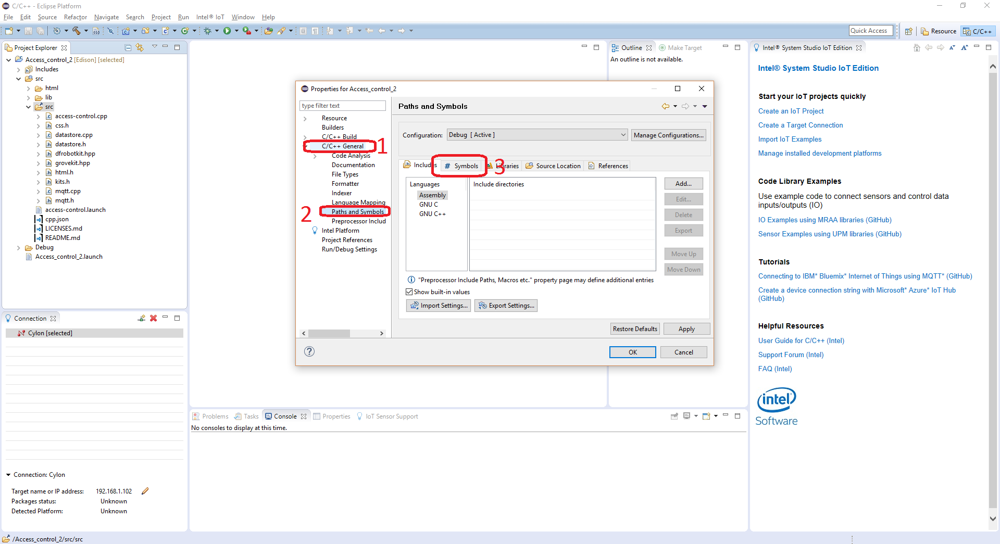

# Access control in C++

## What it is

Using a compatible Intel® IoT Platform, this project lets you create a smart access control system that:

- monitors a motion sensor to detect when a person is in an area that requires authorization.
- can be accessed with your mobile phone via a built-in web interface to disable the alarm.
- keeps track of access data, using cloud-based storage.

## First time setup
For all the samples in this repository, see the  for required boards and libraries.  You need either Grove or DFRobot sensors but not both.

## Hardware requirements

### Grove\*

Sensor | Pin
--- | ---
PIR Motion Sensor | D4
Grove RGB LCD | I2C

### DFRobot\*

Sensor | Pin
--- | ---
PIR (Motion) Sensor | A2

For more specific information on the hardware requirements see 

## Software requirements

1.  and  
2. Microsof Azure\*, IBM Bluemix\*, AT&T M2X\*, AWS\*, Predix\*, or SAP\* account (optional)
3. Note: The following libraries are included with the repo and already linked to in the code 
  -jsoncpp
  -restclient

## Configuring the example for your hardware kit

To configure the example for the specific hardware kit that you are using, either Grove\* or DFRobot\*:

1. From the main menu, select **Project > Properties** dialog box is displayed.

2. Expand the section **C/C++ General**.  Click on the **Paths and Symbols** sub-section, and click on the **Symbols** tab.

3. Now click on **GNU C++**, and click on the **Add** button.

4. In the **Name** field, enter "INTEL_IOT_KIT". In the **Value** field, enter either "GROVEKIT" (this is the default) or "DFROBOTKIT", depending on which hardware kit you wish to use.

5. Your new name symbol and value will now be displayed. Click **OK**.

6. Another dialog box will appear asking to rebuild project. Click **OK**.

## Running the program

To run this example on the board, simply enter

    $ make
    $ build
    $ ./access-control

After running the program, you should see output similar to the one in the image below. 

## Regenerating the HTML and CSS

If you make any changes to either the **index.html** or **styles.css** file, you need to regenerate the .hex file used to serve up the assets via the built-in Crow\* web server.
We have a useful tutorial on how to use the shell script here:

[how-to-run-the-shellscript.md](./../../docs/cpp/how-to-run-the-shellscript.md)

IMPORTANT NOTICE: This software is sample software. It is not designed or intended for use in any medical, life-saving or life-sustaining systems, transportation systems, nuclear systems, or for any other mission-critical application in which the failure of the system could lead to critical injury or death. The software may not be fully tested and may contain bugs or errors; it may not be intended or suitable for commercial release. No regulatory approvals for the software have been obtained, and therefore software may not be certified for use in certain countries or environments.
