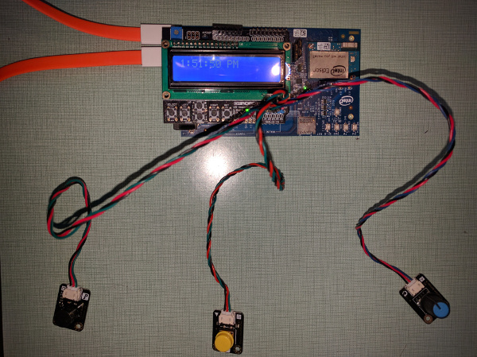
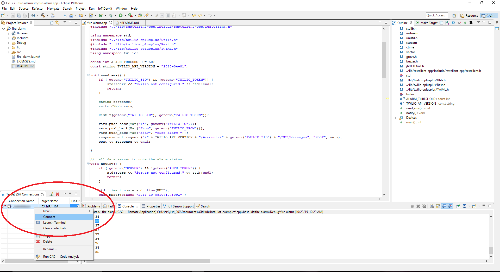
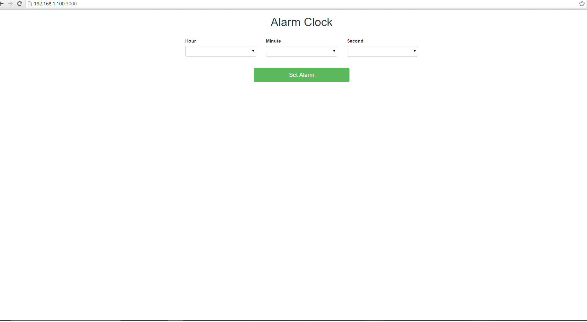

# Alarm clock in Java*

## Introduction

This smart alarm clock application is part of a series of how-to Internet of Things (IoT) code sample exercises using the Intel® IoT Developer Kit, Intel® Edison board, Intel® IoT Gateway, cloud platforms, APIs, and other technologies.

From this exercise, developers will learn how to:

- Connect the Intel® Edison board or Intel® IoT Gateway, computing platforms designed for prototyping and producing IoT and wearable computing products.
- Interface with the Intel® Edison board or Arduino 101\* (branded Genuino 101\* outside the U.S.) board IO and sensor repository using MRAA and UPM from the Intel® IoT Developer Kit, a complete hardware and software solution to help developers explore the IoT and implement innovative projects.
- Run these code samples in the Intel® System Studio IoT Edition (Eclipse IDE for C/C++ and Java\* development) for creating applications that interact with sensors and actuators, enabling a quick start for developing software for the Intel® Edison board or Intel® Galileo board.
- Set up a web application server to set the alarm time and store this alarm data using Azure\* Redis Cache from Microsoft, Redis Store from IBM Bluemix\*, or ElastiCache\* using Redis\* from Amazon Web Services (AWS)\*, different cloud services for connecting IoT solutions including data analysis, machine learning, and a variety of productivity tools to simplify the process of connecting your sensors to the cloud and getting your IoT project up and running quickly.
- Invoke the services of the Weather Underground\* API for accessing weather data.
- Connect to a server using IoT Hub from Microsoft Azure\*, IoT from IBM Bluemix\*, IoT from Amazon Web Services (AWS)\*, AT&T\* M2X\*, GE\* Predix\*, or SAP\* Cloud Platform IoT, different cloud-based IoT platforms for machine to machine communication.


## What it is

Using an Intel® Edison board or Intel® IoT Gateway, this project lets you create a smart alarm clock that:

- can be accessed with your mobile phone via the built-in web interface to set the alarm time.
- displays live weather data on the LCD.
- keeps track of how long it takes you to wake up each morning, using cloud-based data storage.


## How it works

This smart alarm clock has a number of useful features. Set the alarm from yopur mobile phone using a web page served directly from the Intel® Edison board. When the alarm goes off, the buzzer sounds and the LCD indicates it’s time to get up. The rotary dial can be used to adjust the brightness of the display.

In addition, the smart alarm clock can access daily weather data via the Weather Underground\* API and use it to change the color of the LCD.

Optionally, data can be stored using your own Microsoft\* Azure\*, IBM\* Bluemix\*, AT&T\* M2X\*, AWS\*, GE\* Predix\*, or SAP\* account.


## Hardware requirements

Grove\* Starter Kit Plus containing:

1. Intel® Edison board with an Arduino\* breakout board
2. Grove*\ Base Shield V2
3. [Grove Rotary Analog Sensor](http://iotdk.intel.com/docs/master/upm/node/classes/groverotary.html)
4. [Grove Buzzer](http://iotdk.intel.com/docs/master/upm/node/classes/buzzer.html)
5. [Grove Button](http://iotdk.intel.com/docs/master/upm/node/classes/grovebutton.html)
6. [Grove RGB LCD](http://iotdk.intel.com/docs/master/upm/node/classes/jhd1313m1.html)

DFRobot\* Starter Kit for Intel® Edison, containing:

1. Intel® Edison with an Arduino\* breakout board
2. [Buzzer](http://www.dfrobot.com/index.php?route=product/product&product_id=84).
3. [Button](http://iotdk.intel.com/docs/master/upm/node/classes/grovebutton.html)
4. [Rotary Dial]()
5. [LCD Keypad Shield](http://iotdk.intel.com/docs/master/upm/node/classes/sainsmartks.html)


## Software requirements

1. [Intel® System Studio (Eclipse IDE for C/C++ and Java\* development)](https://software.intel.com/en-us/node/672439)
2. Microsoft\* Azure\*, IBM\* Bluemix\*, AT&T\* M2X\*, AWS\*, GE\* Predix\*, or SAP\* account (optional)
3. Weather Underground\* API key


### How to set up

This sample is already one of the IoT examples included in Intel® System Studio. To start using it, follow these steps:

1. From the menu bar, select **File > New > Intel Project for IoT**.<br>

2. Select the desired development board.<br>

3. Select the Operating System curently running on your development board.<br>

4. Select **Intel® IoT Java Maven project**<br>

5. The next tab will ask for connection name and target name. If you do not know these click **Search Target**.<br>

6. From the list of available examples select **How to code Samples**, and select the sample you wish to import<br>

7. Choose a name for your project and click **Finish**<br>
8. Your project source files will now be available on the on the upper left of your IDE by default.<br>


### Connecting the Grove\* sensors

You need to have a Grove\* Base Shield V2 connected to an Arduino\* compatible breakout board to plug all the Grove devices into the Grove Base Shield V2. Make sure you have the tiny VCC switch on the Grove Base Shield V2 set to **5V**.

1. Plug one end of a Grove cable into the Grove Rotary Analog Sensor, and connect the other end to the A0 port on the Grove Base Shield V2.<br>

2. Plug one end of a Grove cable into the Grove Button, and connect the other end to the D4 port on the Grove Base Shield V2.
3. Plug one end of a Grove cable into the Grove Buzzer, and connect the other end to the D5 port on the Grove Base Shield V2.
4. Plug one end of a Grove cable into the Grove RGB LCD, and connect the other end to any of the I2C ports on the Grove Base Shield V2.


### Connecting the DFRobot\* sensors



You need to have a LCD Keypad Shield connected to an Arduino\* compatible breakout board to plug all the DFRobot\* devices into the LCD Keypad Shield.

1. Plug one end of a DFRobot\* cable into the Buzzer, and connect the other end to the A1 port on the LCD Keypad Shield.

2. Plug one end of a DFRobot\* cable into the Button, and connect the other end to the A2 port on the LCD Keypad Shield.

3. Plug one end of a DFRobot\* cable into the Rotary Analog Sensor, and connect the other end to the A3 port on the LCD Keypad Shield.


### Additional setup

You also want to set the current time zone to match the zone you are in. Do this by using the `timedatectl` program on the board. For example:

    timedatectl set-timezone America/Los_Angeles


### Weather Underground\* API key

To optionally fetch the real-time weather information, you need to get an API key from the Weather Underground\* web site:

[http://www.wunderground.com/weather/api](http://www.wunderground.com/weather/api)

You can still run the example, but without a Weather Underground\* API key you cannot retrive weather data. To run the example with the Underground\* API key you need to change the `WEATHER_API_KEY` key in the `config.properties` file to the one that corresponds to your setup. For example:

```

  WEATHER_API_KEY="YOURKEY"

```


Now when you run your program using the **Run** button, it should be able to retrieve real-time weather data from the Intel® Edison board or Intel® IoT Gateway.


### Intel® IoT Gateway setup

You can run this example using an Intel® IoT Gateway connected to an Arduino 101\* (branded Genuino 101\* outside the U.S.).

Make sure your Intel® IoT Gateway is setup using Intel® IoT Gateway Software Suite, by following the directions on the web site here:

https://software.intel.com/en-us/getting-started-with-intel-iot-gateways-and-iotdk

The Arduino 101\* (branded Genuino 101\* outside the U.S.) needs to have the Firmata\* firmware installed. If you have IMRAA installed on your gateway, this will be done automatically. Otherwise, install the StandardFirmata or ConfigurableFirmata sketch manually onto your Arduino 101\* (branded Genuino 101\* outside the U.S.).


### IoT cloud setup

You can optionally store the data generated by this sample program using cloud-based IoT platforms from Microsoft\* Azure\*, IBM\* Bluemix*, AT&T\* M2X\*, AWS\*, GE\* Predix\*, or SAP\*.

For information on how to connect to your own cloud server, go to:

[https://github.com/intel-iot-devkit/iot-samples-cloud-setup](https://github.com/intel-iot-devkit/iot-samples-cloud-setup)


### Data store server setup

Optionally, you can store the data generated by this sample program in a back-end database deployed using Microsoft Azure\*, IBM Bluemix\*, or AWS\*, along with Node.js\*, and a Redis\* data store.

For information on how to set up your own cloud data server, go to:

[https://github.com/intel-iot-devkit/intel-iot-examples-datastore](https://github.com/intel-iot-devkit/intel-iot-examples-datastore)


## Configuring the example for your hardware kit

To configure the example for the specific hardware kit that you are using, either Grove\* or DFRobot\* you will need to change the `INTEL_IOT_KIT` key in the `config.properties` file to either **GROVEKIT** (this is the default) or **DFROBOTKIT**, depending on which hardware kit you wish to use. For example:

```

  INTEL_IOT_KIT=GROVEKIT

```


### Connecting your Intel® Edison board or Intel® IoT Gateway to Intel® System Studio

1. On the **Target SSH Connections** tab, right-click your device and select **Connect**.<br>


If prompted for the username and password, the username is **root** and the password is whatever you specified when configuring the Intel® Edison board or Intel® IoT Gateway.


### Running the example with the cloud server

To run the example with the optional back-end data store, you need to change the `SERVER` and `AUTH_TOKEN` keys in the `config.properties` file to the server URL and authentication token that correspond to your own data store server setup. For example:

```

  SERVER=http://intel-examples.azurewebsites.net/logger/alarm-clock
  AUTH_TOKEN="YOURTOKEN"

```

Now when you run your program using the **Run** button, it should be able to call your server to save the data right from the Intel® Edison board or Intel® IoT Gateway.


## Running the program using Intel® System Studio IoT Edition

When you're ready to run the example, make sure you have saved all the files.

Click the **Run** icon on the toolbar of Intel® System Studio IoT Edition. This runs the code on the Intel® Edison board or Intel® IoT Gateway.


You will see output similar to the following when the program is running.


When the program uploads to the Intel® Edison board, your RGB LCD shows the current time.<br>


## Running the program from the command line

This can be easily achieved with basic Maven commands. For this to work you will need to have Maven installed, a guide can be found on the Maven website: <a href="https://maven.apache.org/install.html">https://maven.apache.org/install.html</a>

### Compiling on host machine and deploying to Intel® Edison board or Intel® IoT Gateway

If you want to compile the project on your local PC and then deploy it to the target you need to run `mvn package` at the location where the `pom.xml` file exists, or you can specify the file location using the `-f` parameter:

	$ mvn package -f <path_to_pom_file>

This will compile the source files and pack them in `.jar` archives. It will create a folder called `target` where you will find two jars, `AlarmClock-1.0-SNAPSHOT.jar` and `AlarmClock-1.0-SNAPSHOT-shaded.jar`. The first one contains only the classes from the current module, while the `shaded` version contains the classes from the current module and its dependencies, so running the program using the second jar will be easier since you don't have to worry about adding all the dependency jars to the classpath.

Next step is to copy the generated jar on the target using `scp`. The following command will copy the file to the `home` folder of user `root` on the Intel® Edison board or Intel® IoT Gateway:

	$ scp target/AlarmClock-1.0-SNAPSHOT-shaded.jar root@<target_ip>:

Then log in on the target using ssh:

	$ ssh root@<target_ip>

Next step is to run the program using `java`, providing the path to the copied jar file and the name of the `main` class:

	# java -cp AlarmClock-1.0-SNAPSHOT-shaded.jar howToCodeSamples.AlarmClock


### Running the program directly on the Intel® Edison board or Intel® IoT Gateway

If you have copied the source files from Git directly on the board and already installed Maven, then you can compile and run the program directly onto the target.
Log in to the board using ssh and navigate to the location of the `pom.xml` file.

First you will need to compile the source files:

	# mvn compile

Then you can execute the program. The following command will run the `main` file in a separate Java process:

	# mvn exec:exec


## Regenerating HTML and CSS

If you make any changes to either the **index.html** or **styles.css** file, you need to regenerate the .hex file used to serve up the assets via the built-in Crow\* web server.
For help using the shell script, go to this link:

[how-to-run-the-shellscript.md](./../../docs/cpp/how-to-run-the-shellscript.md)

## Setting the alarm

The alarm is set using a single-page web interface served directly from the Intel® Edison board or Intel® IoT Gateway while the sample program is running.<br>


The web server runs on port `3000`. If the Intel® Edison board  or Intel® IoT Gateway is connected to Wi-Fi\* on `192.168.1.13`, the address to browse to if you are on the same network is `http://192.168.1.13:3000`.

IMPORTANT NOTICE: This software is sample software. It is not designed or intended for use in any medical, life-saving or life-sustaining systems, transportation systems, nuclear systems, or for any other mission-critical application in which the failure of the system could lead to critical injury or death. The software may not be fully tested and may contain bugs or errors; it may not be intended or suitable for commercial release. No regulatory approvals for the software have been obtained, and therefore software may not be certified for use in certain countries or environments.
