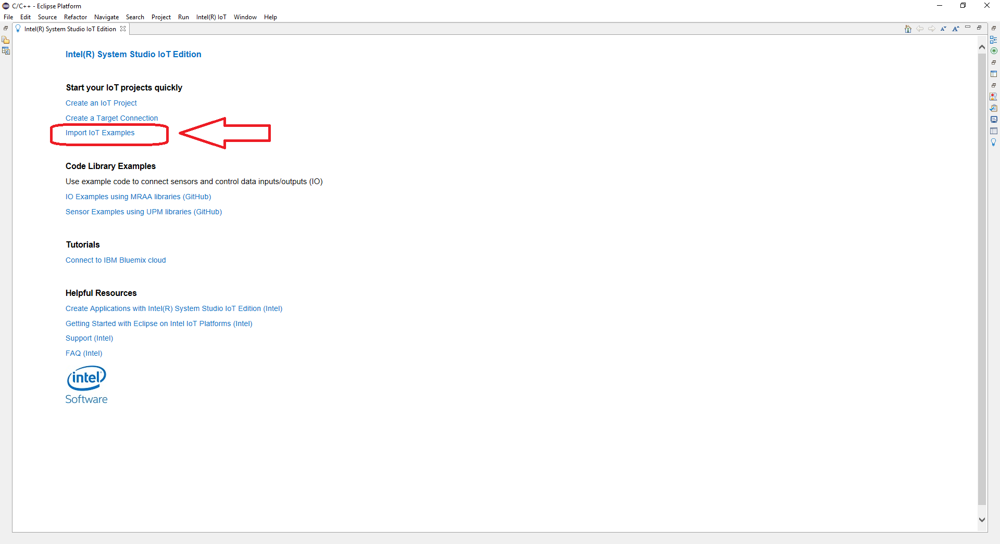
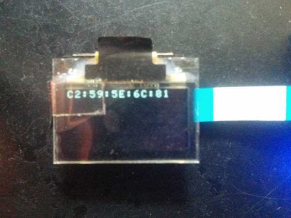

# Bluetooth\* low energy scan bracelet in C++

## Introduction

This Bluetooth\* low energy scan bracelet application is part of a series of how-to Intel IoT code sample exercises using the Intel® IoT Developer Kit, Intel® Edison board, cloud platforms, APIs, and other technologies.

From this exercise, developers will learn how to:

- Connect the Intel® Edison board, a computing platform designed for prototyping and producing IoT and wearable computing products.
- Interface with the Intel® Edison board IO and sensor repository using MRAA and UPM from the Intel® IoT Developer Kit, a complete hardware and software solution to help developers explore the IoT and implement innovative projects.
- Run these code samples in the Intel® System Studio IoT Edition (Eclipse IDE for C/C++ and Java\* development) for creating applications that interact with sensors and actuators, enabling a quick start for developing software for the Intel® Edison or Intel® Galileo board.
- Store detected Bluetooth\* low energy devices using Azure* Redis Cache from Microsoft, Redis Store\* from IBM Bluemix\*, or ElastiCache\* using Redis\* from Amazon Web Services\* (AWS), different cloud services for connecting IoT solutions including data analysis, machine learning, and a variety of productivity tools to simplify the process of connecting your sensors to the cloud and getting your IoT project up and running quickly.
- Set up a MQTT-based server using IoT Hub\* from Microsoft Azure\*, IoT from IBM Bluemix\*, or IoT from Amazon Web Services\* (AWS), different cloud machine to machine messaging services based on the industry standard MQTT protocol.

## What it is

Using an Intel® Edison board, this project lets you create a Bluetooth\* low energy scan bracelet that:

- monitors for Bluetooth\* low energy devices within its scanning range.
- displays information about detected devices using the OLED display.
- keeps track of detected devices, using cloud-based data storage.

## How it works

This BLE scanner bracelet uses a Xadow* expansion board for the Intel® Edison board and the OLED display included in the Xadow kit.

With these components, we'll make a simple BLE scanner that displays information on the OLED display when BLE-equipped devices enter or exit its scanning range.

Optionally, all data can be stored using the Intel IoT Examples Data store or an MQTT server running in your own Microsoft Azure\*, IBM Bluemix\*, or AWS account.

## Hardware requirements

Xadow* Starter Kit containing:

1. Intel® Edison board with a Xadow* expansion board
2. [Xadow - OLED display](http://iotdk.intel.com/docs/master/upm/node/classes/ssd1308.html)

## Software requirements

1. [Intel® System Studio (Eclipse IDE for C/C++ and Java* development)](https://software.intel.com/en-us/node/672439)
2. Microsoft Azure\*, IBM Bluemix\*, or AWS account (optional)

### How to set up

This sample is already one of the IoT examples included in Intel® System Studio. To start using it, follow these steps:

1. From the main menu, select **Intel® IoT > Import IoT Examples**. 

2. Expand the tree view for **C++ > How To Code Samples > BLE Scan Bracelet** and click **Import Example**. 

3. Select your developer board from the selection window then select **Next**. 

4. Select **Intel® IoT C/C++ project** from the Select a project type window then click **Next**. 

5. Select **Yocto** from the Selct target OS dropdown menu then click **Next**. 

6. The next tab will ask for connection name and target name. If you do not know these click **Search Target**. 

7. Select your Edison from the dropdown list. Select **OK**. 

8. Your connection name and target name should be filled in. Select **Finish**. 

9. A new window will open for you and you will need to choose a name for your project and click **Next**. 

10. Your project source files will now be available on the on the upper left of your IDE by default. 

### Connecting the Xadow* sensors

You need to have a Xadow* expansion board connected to the Intel® Edison board to plug in all the Xadow devices.

Plug one end of a Xadow connector into the Xadow OLED, and connect the other end to one of the side connectors on the Xadow expansion board. 

### Intel® Edison board setup

This example also uses the **restclient-cpp** library to perform REST calls to the remote data server. The code can be found in the **lib** directory. The **restclient-cpp** library requires the **libcurl** package, which is already installed on the Intel® Edison board by default.

### Data store server setup

Optionally, you can store the data generated by this sample program in a backend database deployed using Microsoft Azure\*, IBM Bluemix\*, or AWS along with Node.js\*, and a Redis\* data store.

For information on how to set up your own cloud data server, go to:

[https://github.com/intel-iot-devkit/intel-iot-examples-datastore](https://github.com/intel-iot-devkit/intel-iot-examples-datastore)

### MQTT server setup

You can also optionally store the data generated by this sample program using [MQTT](http://mqtt.org/), a Machine To Machine messaging server. You can use MQTT to connect to Microsoft Azure\*, IBM Bluemix\*, or AWS.

For information on how to connect to your own cloud MQTT messaging server, go to:

[https://github.com/intel-iot-devkit/intel-iot-examples-mqtt](https://github.com/intel-iot-devkit/intel-iot-examples-mqtt)

### Connecting your Intel® Edison board to Intel® System Studio

1. On the **Target SSH Connections** tab, right-click your device and select **Connect**. 

If prompted for the username and password, the username is **root** and the password is whatever you specified when configuring the Intel® Edison board.

### Running the example with the cloud server

To run the example with the optional back-end data store, you need to set the `SERVER` and `AUTH_TOKEN` environment variables. You can do this in Intel® System Studio as follows:

1. From the **Run** menu, select **Run Configurations**.  The **Run Configurations** dialog box is displayed.
2. Under **C/C++ Remote Application**, click **doorbell**.  This displays the information for the application.
3. In the **Commands to execute before application** field, add the following environment variables, except use the server and authentication token that correspond to your own setup: 

        chmod 755 /tmp/ble-scanner;export SERVER="http://intel-examples.azurewebsites.net/logger/ble-scanner"; export AUTH_TOKEN="YOURTOKEN"

4. Click **Apply** to save your new environment variables.

Now when you run your program using the **Run** button, it should be able to call your server to save the data right from Intel® Edison board.

### Running the code on the Intel® Edison board

When you're ready to run the example, click **Run** at the top menu bar in Intel® System Studio. 

This compiles the program using the Cross G++ Compiler, links it using the Cross G++ Linker, transfers the binary to the Intel® Edison board, and then executes it on the board itself.

After running the program, you should see output similar to the one in the image below. 

As new BLE devices are detected, their unique IDs are displayed on the OLED screen. 

IMPORTANT NOTICE: This software is sample software. It is not designed or intended for use in any medical, life-saving or life-sustaining systems, transportation systems, nuclear systems, or for any other mission-critical application in which the failure of the system could lead to critical injury or death. The software may not be fully tested and may contain bugs or errors; it may not be intended or suitable for commercial release. No regulatory approvals for the software have been obtained, and therefore software may not be certified for use in certain countries or environments.
