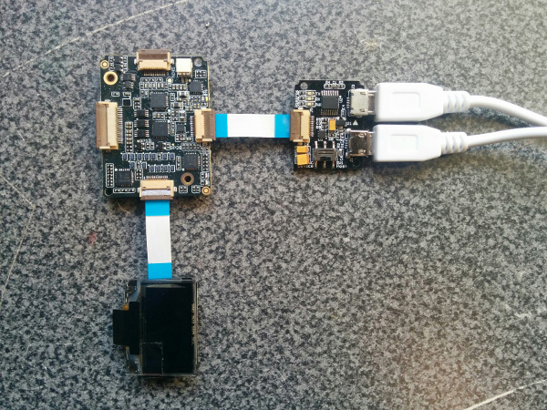
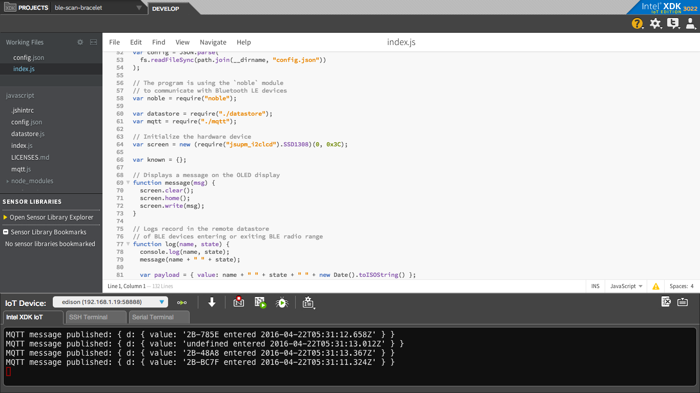

# BLE scan bracelet

## Introduction

This Bluetooth* low energy (BLE) scan bracelet application is part of a series of how-to Intel® IoT code sample exercises using the Intel® IoT Developer Kit, Intel® Edison development platform, cloud platforms, APIs, and other technologies.

From this exercise, developers will learn how to:<br>
- Connect the Intel® Edison development platform, a computing platform designed for prototyping and producing IoT and wearable computing products.<br>
- Interface with the Intel® Edison platform IO and sensor repository using MRAA and UPM from the Intel® IoT Developer Kit, a complete hardware and software solution to help developers explore the IoT and implement innovative projects.<br>
- Run this code sample in Intel® XDK IoT Edition, an IDE for creating new applications that interact with sensors, actuators, and so on, enabling you to get a quick start on developing software for your Intel® Edison or Intel® Galileo board.<br>
- Store detected BLE devices using Azure Redis Cache* from Microsoft* Azure*, cloud services for connecting IoT solutions including data analysis, machine learning, and a variety of productivity tools to simplify the process of connecting your sensors to the cloud and getting your IoT project up and running quickly.

## What it is

Using an Intel® Edison board, this project lets you create a BLE scan bracelet that:<br>
- searches for BLE devices that come within its scanning range;<br>
- displays information about detected devices using the OLED display;<br>
- keeps track of detected devices, using cloud-based data storage.

## How it works

This BLE scanner bracelet uses a Xadow* expansion board for Intel® Edison and the OLED display included in the Xadow* kit.

With these components, we'll make a simple BLE scanner that displays information on the OLED display when BLE-equipped devices enter or exit its scanning range.

Optionally, all data can be stored using the Intel® IoT Example Datastore running in your own Microsoft* Azure* account.

## Hardware requirements

Xadow* Starter Kit containing:

1. Intel® Edison with a Xadow* expansion board
2. [Xadow* - OLED display](http://iotdk.intel.com/docs/master/upm/node/classes/ssd1308.html)

## Software requirements

1. Intel® XDK IoT Edition
2. Microsoft* Azure* account

### How to set up

To begin, clone the **Intel® IoT Examples** repository with Git* on your computer as follows:

    $ git clone https://github.com/intel-iot-devkit/how-to-code-samples.git

Want to download a .zip file? In your web browser, go to <a href="https://github.com/intel-iot-devkit/how-to-code-samples">https://github.com/intel-iot-devkit/how-to-code-samples</a> and click the **Download ZIP** button at the lower right. Once the .zip file is downloaded, uncompress it, and then use the files in the directory for this example.

## Adding the program to Intel® XDK IoT Edition

In Intel® XDK IoT Edition, select **Import Your Node.js Project**:


Then, navigate to the directory where the example project exists, and select it:


You need to connect to your Intel® Edison board from your computer to send code to it.


Click the **IoT Device** menu at the bottom left. If your Intel® Edison is automatically recognized, select it.


Otherwise, select **Add Manual Connection**.
In the **Address** field, type `192.168.2.15`. In the **Port** field, type `58888`.
Click **Connect** to save your connection.

### Installing the program manually on Intel® Edison

Alternatively, you can set up the code manually on the Intel® Edison board.

Clone the **Intel® IoT Examples** repository to your Intel® Edison board after you establish an SSH connection to it, as follows:

    $ git clone https://github.com/intel-iot-devkit/how-to-code-samples.git

Then, navigate to the directory with this example.

To install Git* on Intel® Edison, if you don’t have it yet, establish an SSH connection to the board and run the following command:

    $ opkg install git

### Set up Intel® Edison for BLE development

For information on how to set up Intel® Edison for BLE development, see this post by Rex St John: 

<a href="http://rexstjohn.com/configure-intel-edison-for-bluetooth-le-smart-development">http://rexstjohn.com/configure-intel-edison-for-bluetooth-le-smart-development</a>

### Connecting the Xadow* sensors



You need to have a Xadow* expansion board connected to Intel® Edison to plug in all the Xadow* devices.

For more information on how to set up this expansion board, see this wiki page:

<a href="http://www.seeedstudio.com/wiki/Xadow_-_Edison">http://www.seeedstudio.com/wiki/Xadow_-_Edison</a>

Plug one end of a Xadow* connector into the Xadow* OLED, and connect the other end to one of the side connectors on the Xadow* expansion board.

### Manual Intel® Edison setup

If you're running this code on your Intel® Edison manually, you need to install some dependencies.

To obtain the Node.js* modules needed for this example to execute on Intel® Edison, run the following command:

```
npm install
```

### Microsoft* Azure* server setup

Optionally, you can store the data generated by this example program in a backend database deployed using Microsoft* Azure\*, Node.js\*, and a Redis* data store.

For information on how to set up your own cloud data server, go to:

<a href="https://github.com/intel-iot-devkit/how-to-code-samples-datastore">https://github.com/intel-iot-devkit/how-to-code-samples-datastore</a>

## Configuring The Example

To configure the example for the optional Microsoft* Azure* data store, change the `SERVER` and `AUTH_TOKEN` keys in the `config.json` file as follows:

```
{
  "SERVER": "http://intel-examples.azurewebsites.net/logger/access-control",
  "AUTH_TOKEN": "s3cr3t"
}
```

## Running the program using Intel® XDK IoT Edition

When you're ready to run the example, make sure you saved all the files.


Click the **Upload** icon to upload the files to the Intel® Edison board.


Click the **Run** icon at the bottom of Intel® XDK IoT Edition. This runs the code on Intel® Edison.


If you made changes to the code, click **Upload and Run**. This runs the latest code with your changes on Intel® Edison.



You will see output similar to the above when the program is running.

## Running the program manually

To run the example manually on Intel® Edison, establish an SSH connection to the board and execute the following command:

    node index.js

### Determining the Intel® Edison IP address

You can determine what IP address Intel® Edison is connected to by running the following command:

    ip addr show | grep wlan

You will see the output similar to the following:

    3: wlan0: <BROADCAST,MULTICAST,UP,LOWER_UP> mtu 1500 qdisc pfifo_fast qlen 1000
        inet 192.168.1.13/24 brd 192.168.1.255 scope global wlan0

The IP address is shown next to `inet`. In the example above, the IP address is `192.168.1.13`.
