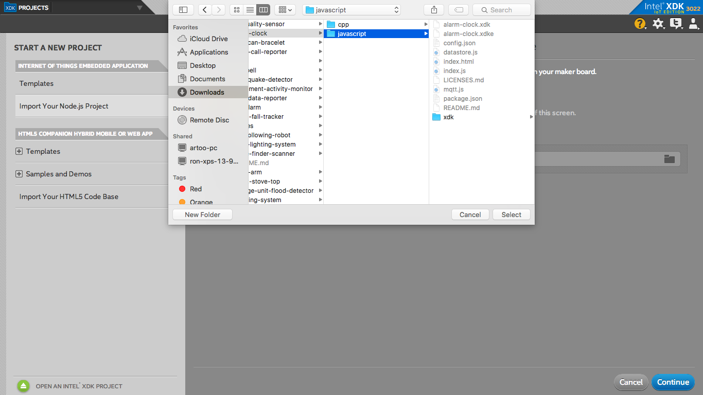
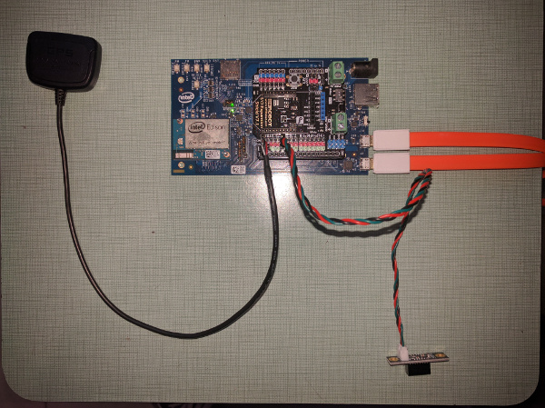
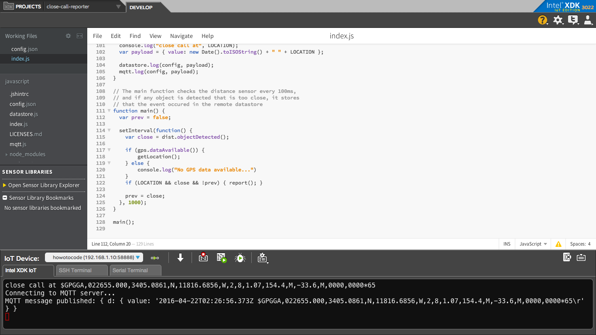

# Close call reporter in JavaScript*

## Introduction

This close call fleet driving reporter application is part of a series of how-to Internet of Things (IoT)code sample exercises using the Intel® IoT Developer Kit, Intel® Edison development platform, cloud platforms, APIs, and other technologies.

From this exercise, developers will learn how to:<br>
- Connect the Intel® Edison development platform, a computing platform designed for prototyping and producing IoT and wearable computing products.<br>
- Interface with the Intel® Edison platform IO and sensor repository using MRAA and UPM from the Intel® IoT Developer Kit, a complete hardware and software solution to help developers explore the IoT and implement innovative projects.<br>
- Run this code sample in Intel® XDK IoT Edition, an IDE for creating applications that interact with sensors and actuators, enabling a quick start for developing software for the Intel® Edison board or from the Intel® Galileo board.<br>
- Store the close-call data using Azure Redis Cache\* from Microsoft Azure\*, Redis Store\* from IBM Bluemix\*, or Elasticache\* using Redis\* from Amazon Web Services (AWS)\*, different cloud services for connecting IoT solutions including data analysis, machine learning, and a variety of productivity tools to simplify the process of connecting your sensors to the cloud and getting your IoT project up and running quickly.
- Connect to a server using IoT Hub from Microsoft Azure\*, IoT from IBM Bluemix\*, IoT from Amazon Web Services (AWS)\*, AT&T M2X\*, Predix\* from GE, or SAP Cloud Platform\* IoT, different cloud-based IoT platforms for machine to machine communication.

## What it is

Using an Intel® Edison board, this project lets you create a close call fleet driving reporter that:<br>
- monitors the Grove\* IR Distance Interrupter.<br>
- monitors the Grove\* GPS.<br>
- keeps track of close calls and logs them using cloud-based data storage.

## How it works

This close call reporter system monitors the direction the IR Distance sensor is pointed to.

It also keeps track of the GPS position, updating the position frequently to ensure accurate data.

Optionally, data can be stored using your own Microsoft Azure\*, IBM Bluemix\*, AT&T M2X\*, AWS\*, Predix\*, or SAP\* account.

## Hardware requirements

Grove\* Transportation and Safety Kit, containing:

1. Intel® Edison module with an Arduino\* breakout board
2. [Grove\* IR Distance Interrupter](http://iotdk.intel.com/docs/master/upm/node/classes/rfr359f.html)
3. [Grove\* GPS](http://iotdk.intel.com/docs/master/upm/node/classes/ublox6.html)

DFRobot\* Starter Kit for Intel® Edison, containing:

1. Intel® Edison module with an Arduino\* breakout board
2. [IR Distance Sensor](http://www.dfrobot.com/index.php?route=product/product&product_id=572)
3. [GPS](http://iotdk.intel.com/docs/master/upm/node/classes/ublox6.html)
4. [I/O Expansion Shield](http://www.dfrobot.com/index.php?route=product/product&product_id=1009)

## Software requirements

1. Intel® XDK IoT Edition
2. Microsoft Azure\*, IBM Bluemix\*, AT&T M2X\*, AWS\*, Predix\*, or SAP\* account (optional)

### How to set up

To begin, clone the **How-To Code Samples** repository with Git\* on your computer as follows:

    $ git clone https://github.com/intel-iot-devkit/how-to-code-samples.git

To download a .zip file, in your web browser go to <a href="https://github.com/intel-iot-devkit/how-to-code-samples">https://github.com/intel-iot-devkit/how-to-code-samples</a> and click the **Download ZIP** button at the lower right. Once the .zip file is downloaded, uncompress it, and then use the files in the directory for this example.

## Adding the program to Intel® XDK IoT Edition

In Intel® XDK IoT Edition, select **Import Your Node.js Project**:


On the **New Project** screen, click on the folder icon:


Navigate to the directory where the example project exists and select it:



Choose a name for the project and click on the **Create** button. Then click on the **Continue** button to finish creating your project:


You need to connect to your Intel® Edison board from your computer to send code to it.


Click the **IoT Device** menu at the bottom left. If your Intel® Edison board is automatically recognized, select it.


Otherwise, select **Add Manual Connection**.
In the **Address** field, type `192.168.2.15`. In the **Port** field, type `58888`.
Click **Connect** to save your connection.

### Installing the program manually on the Intel® Edison board

Alternatively, you can set up the code manually on the Intel® Edison board.

Clone the **How-To Code Samples** repository to your Intel® Edison board after you establish an SSH connection to it, as follows:

    $ git clone https://github.com/intel-iot-devkit/how-to-code-samples.git

Then, navigate to the directory with this example.

To install Git\* on Intel® Edison board, if you don’t have it yet, establish an SSH connection to the board and run the following command:

    $ opkg install git

### Connecting the Grove\* sensors


You need to have a Grove\* Shield connected to an Arduino\* compatible breakout board to plug all the Grove devices into the Grove Shield. Make sure you have the tiny VCC switch on the Grove\* Shield set to **5V**.

Sensor | Pin
--- | ---
Grove\* IR Distance Interrupter | D2
Grove\* GPS | UART port

### Connecting the DFRobot\* sensors



You need to have a DFRobot\* I/O Expansion Shield connected to an Arduino\* compatible breakout board to plug all the DFRobot\* devices into the DFRobot\* I/O Expansion Shield.

Sensor | Pin
--- | ---
IR Distance Sensor | D4
GPS cable TX (white) | RX pin
GPS cable RX (black) | TX pin
GPS cable power (red) | 5V pins
GPS cable ground (thicker black) | GND

### Manual Intel® Edison board setup

If you're running this code on your Intel® Edison board manually, you need to install some dependencies.

To obtain the Node.js\* modules needed for this example to execute on the Intel® Edison board, run the following command:

```
npm install
```

### IoT cloud setup

You can optionally store the data generated by this sample program using cloud-based IoT platforms from Microsoft Azure\*, IBM Bluemix\*, AT&T M2X\*, AWS\*, Predix\*, or SAP\*.

For information on how to connect to your own cloud server, go to:

[https://github.com/intel-iot-devkit/iot-samples-cloud-setup](https://github.com/intel-iot-devkit/iot-samples-cloud-setup)

### Data store server setup

Optionally, you can store the data generated by this sample program in a backend database deployed using Microsoft Azure\*, IBM Bluemix\*, or AWS, along with Node.js\*, and a Redis\* data store.

For information on how to set up your own cloud data server, go to:

[https://github.com/intel-iot-devkit/intel-iot-examples-datastore](https://github.com/intel-iot-devkit/intel-iot-examples-datastore)

## Configuring the example

To configure the example for the Grove\* kit, just leave the `kit` key in the `config.json` set to `grove`. To configure the example for the DFRobot\* kit, change the `kit` key in the `config.json` to `dfrobot` as follows:

```
{
  "kit": "dfrobot"
}
```

To configure the example for the optional Microsoft Azure\*, IBM Bluemix\*, or AWS data store, change the `SERVER` and `AUTH_TOKEN` keys in the `config.json` file as follows:

```
{
  "kit": "grove",
  "SERVER": "http://intel-examples.azurewebsites.net/logger/access-control",
  "AUTH_TOKEN": "s3cr3t"
}
```

For information on how to configure the example for an optional Microsoft Azure\*, IBM Bluemix\*, AT&T M2X\*, AWS\*, Predix\*, or SAP\* IoT cloud server, go to:

[https://github.com/intel-iot-devkit/iot-samples-cloud-setup](https://github.com/intel-iot-devkit/iot-samples-cloud-setup)

## Running the program using Intel® XDK IoT Edition

When you're ready to run the example, make sure you have saved all the files.


Click the **Upload** icon to upload the files to the Intel® Edison board.


Click the **Run** icon at the bottom of Intel® XDK IoT Edition. This runs the code on the Intel® Edison board.


If you made changes to the code, click **Upload and Run**. This runs the latest code with your changes on the Intel® Edison board.



You will see output similar to the above when the program is running.

## Running the program manually

To run the example manually on the Intel® Edison board, establish an SSH connection to the board and execute the following command:

    node index.js

### Determining the Intel® Edison board's IP address

You can determine what IP address the Intel® Edison board is connected to by running the following command:

    ip addr show | grep wlan

You will see the output similar to the following:

    3: wlan0: <BROADCAST,MULTICAST,UP,LOWER_UP> mtu 1500 qdisc pfifo_fast qlen 1000
        inet 192.168.1.13/24 brd 192.168.1.255 scope global wlan0

The IP address is shown next to `inet`. In the example above, the IP address is `192.168.1.13`.

IMPORTANT NOTICE: This software is sample software. It is not designed or intended for use in any medical, life-saving or life-sustaining systems, transportation systems, nuclear systems, or for any other mission-critical application in which the failure of the system could lead to critical injury or death. The software may not be fully tested and may contain bugs or errors; it may not be intended or suitable for commercial release. No regulatory approvals for the software have been obtained, and therefore software may not be certified for use in certain countries or environments.
