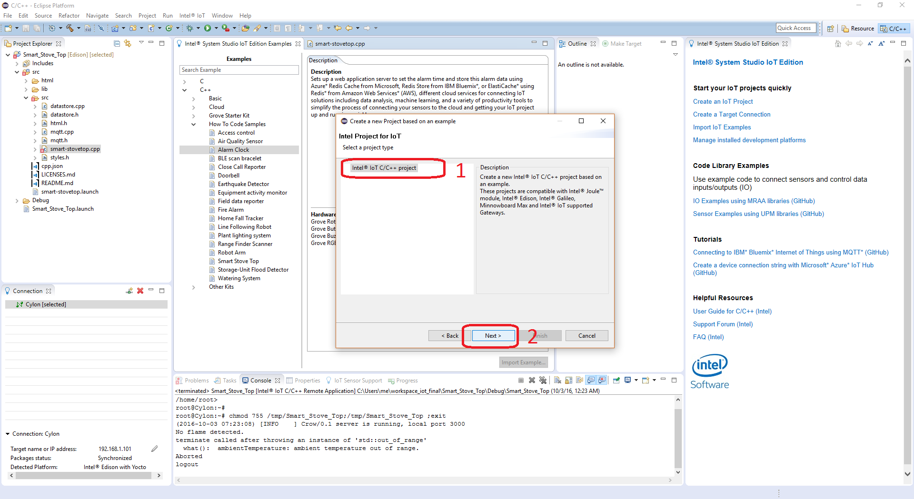
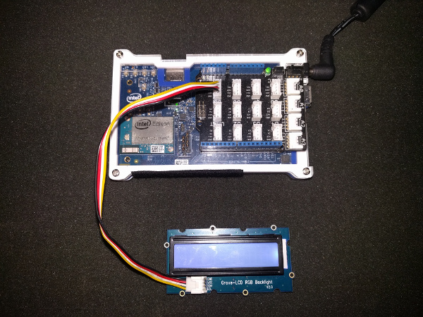

# Color match game in C++

## Introduction

This color match game application is part of a series of how-to Intel® Internet of Things (IoT) code sample exercises using the Intel® IoT Developer Kit, Intel® Edison board, Intel® IoT Gateway, cloud platforms, APIs, and other technologies:

From this exercise, developers will learn how to:

- Connect the Intel® Edison board or Intel® IoT Gateway, computing platforms designed for prototyping and producing IoT and wearable computing products.
- Interface with the Intel® Edison board or Arduino 101\* (branded Genuino 101\* outside the U.S.) board IO and sensor repository using MRAA and UPM from the Intel® IoT Developer Kit, a complete hardware and software solution to help developers explore the IoT and implement innovative projects.
- Run these code samples in the Intel® System Studio IoT Edition (Eclipse IDE for C/C++ and Java\* development) for creating applications that interact with sensors and actuators, enabling a quick start for developing software for the Intel® Edison board or the Intel® Galileo board.
- Set up a web application server to let users play the color matching game using their web browser.

## What it is

Using an Intel® Edison board or or Intel® IoT Gateway, this project lets you create a color match game. 
- a UI of the game is exposed through an embedded server, providing with buttons for color matching as well as a "start game" button 
- when starting the game, for each level a sequence of colors is displayed on the RGB LCD screen of the Intel® Edison board or Arduino 101\* (branded Genuino 101\* outside the U.S.) board. The player needs to click on the corresponding buttons on the website.
- for each level the sequence has one more color. 
- when a user clicks a color, the same color is displayed on the RGB LCD screen. 

## Hardware requirements

Grove\* Starter Kit containing:

1. Intel® Edison board with an Arduino\* compatible breakout board or Intel® IoT Gateway with a Arduino 101\* (branded Genuino 101\* outside the U.S.) board
2. [Grove\* RGB LCD](http://iotdk.intel.com/docs/master/upm/node/classes/jhd1313m1.html)

## Software requirements

1. [Intel® System Studio (Eclipse IDE for C/C++ and Java* development)](https://software.intel.com/en-us/node/672439)

### How to set up

This sample is already one of the IoT examples included in Intel® System Studio. To start using it, follow these steps:

1. From the main menu, select **Intel® IoT > Import IoT Examples**. 

2. Expand the tree view for **C++ > How To Code Samples > Access control** and click **Import Example**. 

3. Select your developer board from the selection window then select **Next**. 

4. Select **Intel® IoT C/C++ project** from the Select a project type window then click **Next**. 

5. Select **Yocto** from the Selct target OS dropdown menu then click **Next**. 

6. The next tab will ask for connection name and target name. If you do not know these click **Search Target**. 

7. Select your Edison from the dropdown list. Select **OK**. 

8. Your connection name and target name should be filled in. Select **Finish**. 

9. A new window will open for you and you will need to choose a name for your project and click **Next**. 

10. Your project source files will now be available on the on the upper left of your IDE by default. 

### Connecting the Grove\* sensors

You need to have a Grove\* Shield connected to an Arduino-compatible breakout board to plug all the Grove\* devices into the Grove Shield. Make sure you have the tiny VCC switch on the Grove\* Shield set to **5V**.

1. Plug one end of a Grove cable into the Grove RGB LCD, and connect the other end to any of the I2C ports on the Grove Shield.

### Intel® IoT Gateway setup

You can run this example using an Intel® IoT Gateway connected to an Arduino 101\* (branded Genuino 101\* outside the U.S.) 101.

Make sure your Intel® IoT Gateway is setup using Intel® IoT Gateway Software Suite, by following the directions on the web site here:

https://software.intel.com/en-us/getting-started-with-intel-iot-gateways-and-iotdk

The Arduino 101\* (branded Genuino 101\* outside the U.S.) needs to have the Firmata\* firmware installed. If you have IMRAA installed on your gateway, this will be done automatically. Otherwise, install the StandardFirmata or ConfigurableFirmata sketch manually onto your Arduino 101\* (branded Genuino 101\* outside the U.S.).

### Connecting your Intel® Edison board or Intel® IoT Gateway to Intel® System Studio

1. On the **Target SSH Connections** tab, right-click your device and select **Connect**. 

If prompted for the username and password, the username is **root** and the password is whatever you specified when configuring the Intel® Edison board.

### Running the code on the Intel® Edison board or Intel® IoT Gateway

When you're ready to run the example, click **Run** at the top menu bar in Intel® System Studio. 

This compiles the program using the Cross G++ Compiler, links it using the Cross G++ Linker, transfers the binary to the Intel® Edison board, and then executes it on the board itself.

After running the program, you should see output similar to the one in the image below. 

## Regenerating the HTML and CSS

If you make any changes to either the **index.html** or **styles.css** file, you need to regenerate the .hex file used to serve up the assets via the built-in Crow\* web server.
We have a useful tutorial on how to use the shell script here:

[how-to-run-the-shellscript.md](./../../docs/cpp/how-to-run-the-shellscript.md)

### Accessing the game

The color match game is set using a single-page web interface served from the Intel® Edison board or Intel® IoT Gateway while the sample program is running.

The web server runs on port `3000`, so if the Intel® Edison board or Intel® IoT Gateway are connected to Wi-Fi\* on `192.168.1.13`, the address to browse to if you are on the same network is `http://192.168.1.13:3000/`.

IMPORTANT NOTICE: This software is sample software. It is not designed or intended for use in any medical, life-saving or life-sustaining systems, transportation systems, nuclear systems, or for any other mission-critical application in which the failure of the system could lead to critical injury or death. The software may not be fully tested and may contain bugs or errors; it may not be intended or suitable for commercial release. No regulatory approvals for the software have been obtained, and therefore software may not be certified for use in certain countries or environments.
