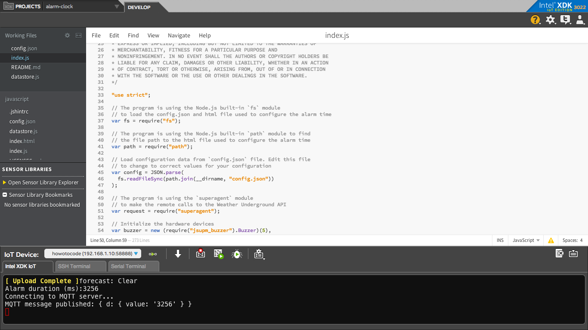

## What it is

Using a compatible Intel-based platform, this project lets you create a color match game.<br>
- a UI of the game is exposed through an embedded server, providing with buttons for color matching as well as a "start game" button<br>
- when starting the game, for each level a sequence of colors is displayed on the RGB LCD screen of the Intel® Edison board or Arduino 101\* (branded Genuino 101\* outside the U.S.) board. The player needs to click on the corresponding buttons on the website.
- for each level the sequence has one more color.<br>
- when a user clicks a color, the same color is displayed on the RGB LCD screen.<br>
- different tones are played when user clicks on color buttons.

## First time setup  
For all the samples in this repository, see the  for required boards and libraries. You need either Grove or DFRobot sensors but not both.

## Hardware requirements

### Grove\*

You need to have a Grove\* Shield connected to an Arduino-compatible breakout board to plug all the Grove\* devices into the Grove Shield. Make sure you have the tiny VCC switch on the Grove\* Shield set to **5V**.

Sensor | Pin
--- | ---
Grove RGB LCD | I2C

More details on the hardware requirements can be found in the 

## Software requirements

1.  and  
1. Node.js 
2. MRAA and UPM Node.js bindings <link to mraa and upm install docs>
2. Packages as listed in the package.json file in this example 

## Configuring the example

To configure the example for the Intel® Edison board, just leave the `platform` key in the `config.json` set to `edison`.

To configure the example for the Arduino 101\* (branded Genuino 101\* outside the U.S.), change the `platform` key to the value `firmata` in the `config.json`, as follows:

```
{
  "platform": "firmata"
}
```
## Running the program 

To run this example on the board, simply enter

    $ npm install
    $ npm run
    $ ./color-match-game

You will see output similar to below when the program is running.



Refer to  for details on the functionality.

IMPORTANT NOTICE: This software is sample software. It is not designed or intended for use in any medical, life-saving or life-sustaining systems, transportation systems, nuclear systems, or for any other mission-critical application in which the failure of the system could lead to critical injury or death. The software may not be fully tested and may contain bugs or errors; it may not be intended or suitable for commercial release. No regulatory approvals for the software have been obtained, and therefore software may not be certified for use in certain countries or environments.
