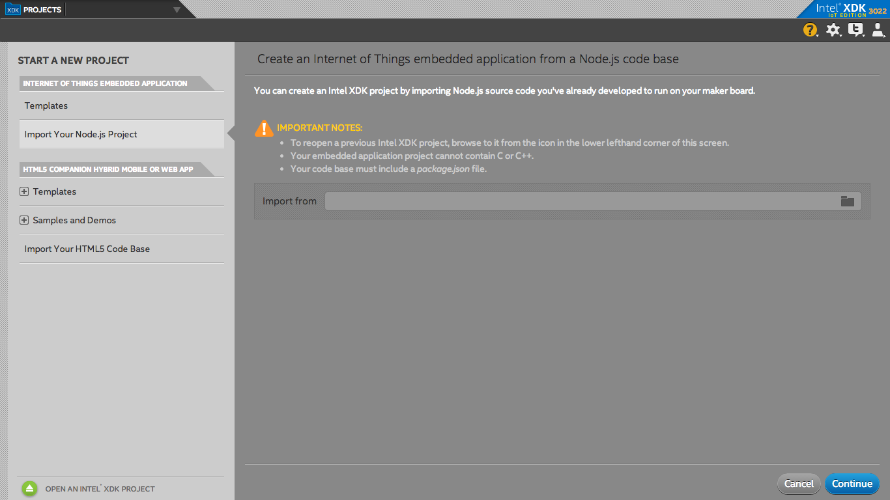
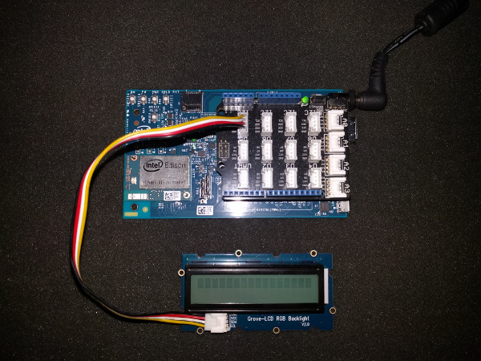
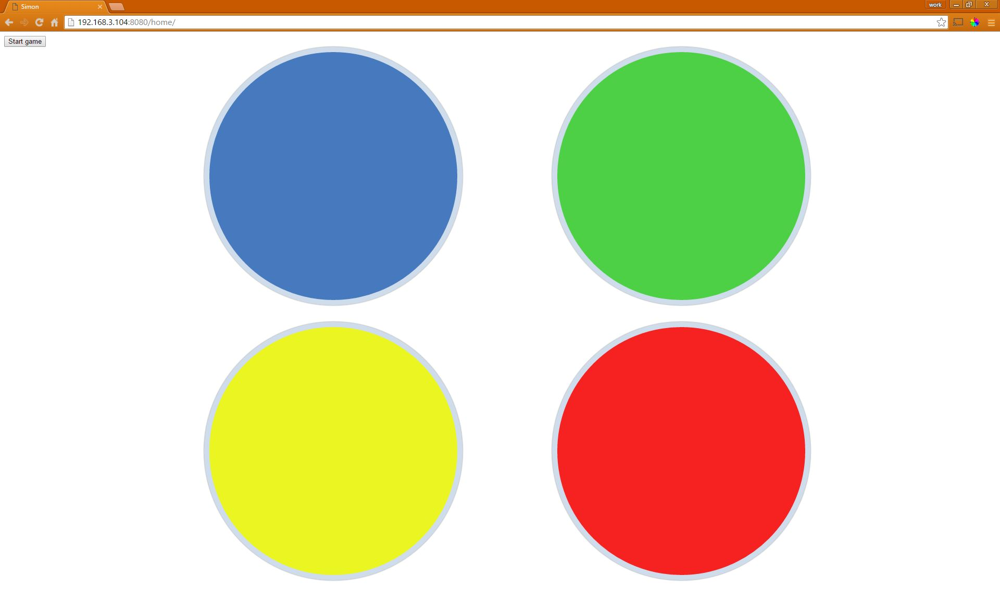

# Color match game in JavaScript*

## Introduction

This Color Match Game application is part of a series of how-to Intel® Internet of Things (IoT) code sample exercises using the Intel® IoT Developer Kit, Intel® Edison board, Intel® IoT Gateway, cloud platforms, APIs, and other technologies.

From this exercise, developers will learn how to:<br>

- Connect the Intel® Edison board or Intel® IoT Gateway, computing platforms designed for prototyping and producing IoT and wearable computing products.<br>
- Interface with the Intel® Edison board or Arduino 101\* (branded Genuino 101\* outside the U.S.) board IO and sensor repository using MRAA and UPM from the Intel® IoT Developer Kit, a complete hardware and software solution to help developers explore the IoT and implement innovative projects.<br>
- Run this code sample in Intel® XDK IoT Edition, an IDE for creating applications that interact with sensors and actuators, enabling a quick start for developing software for the Intel® Edison board or Intel® IoT Gateway.<br>
- Set up a web application server to let users play the color matching game using their web browser.

## What it is

Using an Intel® Edison board or or Intel® IoT Gateway, this project lets you create a color match game.<br>
- a UI of the game is exposed through an embedded server, providing with buttons for color matching as well as a "start game" button<br>
- when starting the game, for each level a sequence of colors is displayed on the RGB LCD screen of the Intel® Edison board or Arduino 101\* (branded Genuino 101\* outside the U.S.) board. The player needs to click on the corresponding buttons on the website.
- for each level the sequence has one more color.<br>
- when a user clicks a color, the same color is displayed on the RGB LCD screen.<br>
- different tones are played when user clicks on color buttons.

## How it works

Description goes here...

## Hardware requirements

Grove\* Starter Kit containing:

1. Intel® Edison board with an Arduino\* compatible breakout board or Intel® IoT Gateway with a Arduino 101\* (branded Genuino 101\* outside the U.S.) board
2. [Grove\* RGB LCD](http://iotdk.intel.com/docs/master/upm/node/classes/jhd1313m1.html)

## Software requirements

1. Intel® XDK IoT Edition

### How to set up

To begin, clone the **How-To Intel IoT Code Samples** repository with Git\* on your computer as follows:

    $ git clone https://github.com/intel-iot-devkit/how-to-code-samples.git

To download a .zip file, in your web browser go to <a href="https://github.com/intel-iot-devkit/how-to-code-samples">https://github.com/intel-iot-devkit/how-to-code-samples</a> and click the **Download ZIP** button at the lower right. Once the .zip file is downloaded, uncompress it, and then use the files in the directory for this example.

## Adding the program to Intel® XDK IoT Edition

In Intel® XDK IoT Edition, select **Import Your Node.js Project**:


On the **New Project** screen, click on the folder icon:



Then, navigate to the directory where the example project exists, and select it:


Choose a name for the project, then click on the **Create** button. Then click on the **Continue** button to finish creating your project:


You need to connect to your Intel® Edison board from your computer to send code to it.


Click the **IoT Device** menu at the bottom left. If your Intel® Edison board is automatically recognized, select it.


Otherwise, select **Add Manual Connection**.
In the **Address** field, type `192.168.2.15`. In the **Port** field, type `58888`.
Click **Connect** to save your connection.

### Installing the program manually on the Intel® Edison board

Alternatively, you can set up the code manually on the Intel® Edison board.

Clone the **How-To Intel IoT Code Samples** repository to your Intel® Edison board after you establish an SSH connection to it, as follows:

    $ git clone https://github.com/intel-iot-devkit/how-to-code-samples.git

Then, navigate to the directory with this example.

To install Git\* on the Intel® Edison board (if you don’t have it yet), establish an SSH connection to the board and run the following command:

    $ opkg install git

### Connecting the Grove\* sensors



You need to have a Grove\* Shield connected to an Arduino-compatible breakout board to plug all the Grove\* devices into the Grove Shield. Make sure you have the tiny VCC switch on the Grove\* Shield set to **5V**.

1. Plug one end of a Grove cable into the Grove RGB LCD, and connect the other end to any of the I2C ports on the Grove Shield.

### Manual Intel® Edison setup

If you're running this code on your Intel® Edison board manually, you need to install some dependencies.

To obtain the Node.js\* modules needed for this example to execute on the Intel® Edison board, run the following command:

```
npm install
```

### Intel® IoT Gateway setup

You can run this example using an Intel® IoT Gateway connected to an Arduino 101\* (branded Genuino 101\* outside the U.S.) board.

Make sure your Intel® IoT Gateway is setup using Intel® IoT Gateway Software Suite, by following the directions on the web site here:

https://software.intel.com/en-us/getting-started-with-intel-iot-gateways-and-iotdk

You must install the Intel® XDK on the Intel® IoT Gateway, by following the directions on the above link, under the section "Connecting to the Intel® XDK".

The Arduino 101\* (branded Genuino 101\* outside the U.S.) board needs to have the Firmata\* firmware installed. If you have IMRAA installed on your gateway, this will be done automatically. Otherwise, install the StandardFirmata or ConfigurableFirmata sketch manully on to your Arduino 101\* (branded Genuino 101\* outside the U.S.) board.

You will also need to configure the `config.json` in the example to use the Arduino 101\* (branded Genuino 101\* outside the U.S.) board. See the section "Configuring the example" below.

## Configuring the example

To configure the example for the Intel® Edison board, just leave the `platform` key in the `config.json` set to `edison`.

To configure the example for the Arduino 101\* (branded Genuino 101\* outside the U.S.), change the `platform` key to the value `firmata` in the `config.json`, as follows:

```
{
  "platform": "firmata"
}
```

## Running the program using Intel® XDK IoT Edition

When you're ready to run the example, make sure you saved all the files.


Click the **Upload** icon to upload the files to the Intel® Edison board.


Click the **Run** icon at the bottom of Intel® XDK IoT Edition. This runs the code on the Intel® Edison board.


If you made changes to the code, click **Upload and Run**. This runs the latest code with your changes on the Intel® Edison board.


You will see output similar to the above when the program is running.

## Running the program manually

To run the example manually on the Intel® Edison board, establish an SSH connection to the board and execute the following command:

    node index.js

### Accessing the game



The color match game is set using a single-page web interface served from the Intel® Edison board or Intel® IoT Gateway while the sample program is running.

The web server runs on port `8080`, so if the Intel® Edison board or Intel® IoT Gateway are connected to Wi-Fi\* on `192.168.1.13`, the address to browse to if you are on the same network is `http://192.168.1.13:8080/home`.

### Determining the Intel® Edison IP address

You can determine what IP address the Intel® Edison board is connected to by running the following command:

    ip addr show | grep wlan

You will see the output similar to the following:

    3: wlan0: <BROADCAST,MULTICAST,UP,LOWER_UP> mtu 1500 qdisc pfifo_fast qlen 1000
        inet 192.168.1.13/24 brd 192.168.1.255 scope global wlan0

The IP address is shown next to `inet`. In the example above, the IP address is `192.168.1.13`.

IMPORTANT NOTICE: This software is sample software. It is not designed or intended for use in any medical, life-saving or life-sustaining systems, transportation systems, nuclear systems, or for any other mission-critical application in which the failure of the system could lead to critical injury or death. The software may not be fully tested and may contain bugs or errors; it may not be intended or suitable for commercial release. No regulatory approvals for the software have been obtained, and therefore software may not be certified for use in certain countries or environments.
