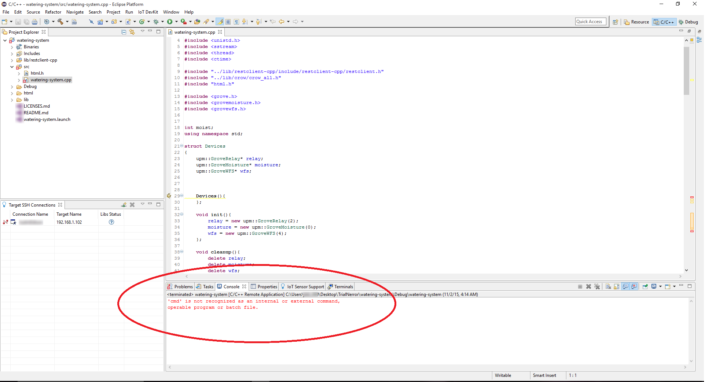
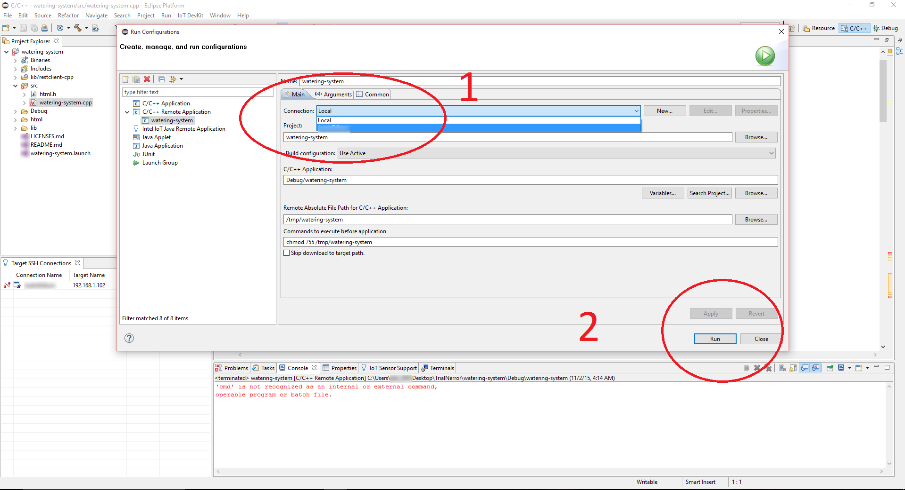
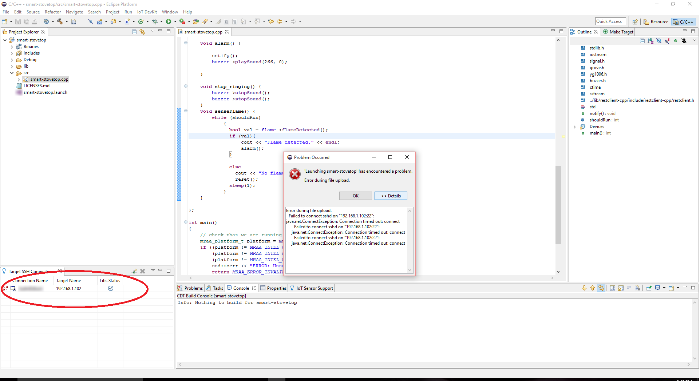
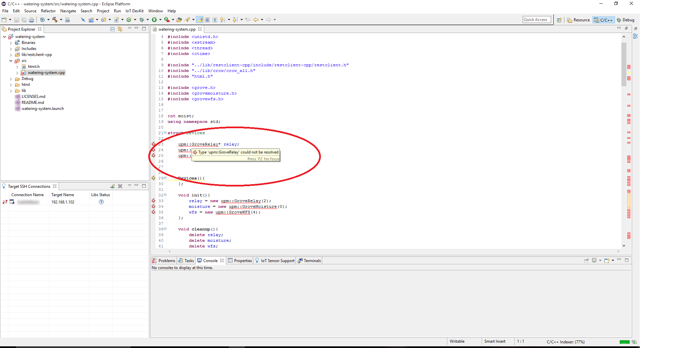
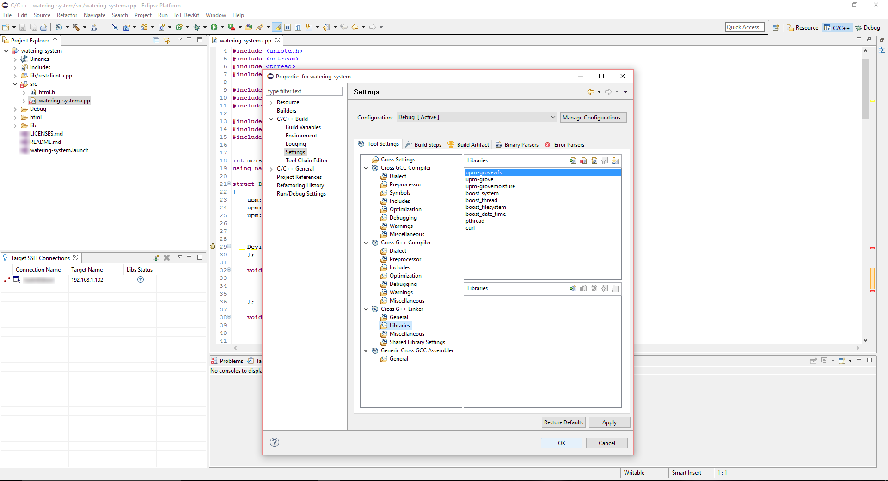
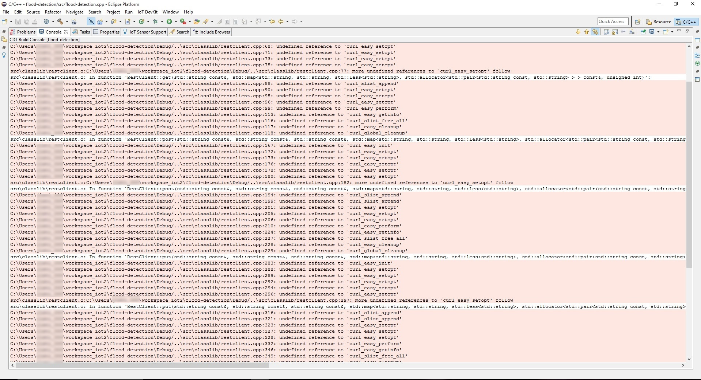
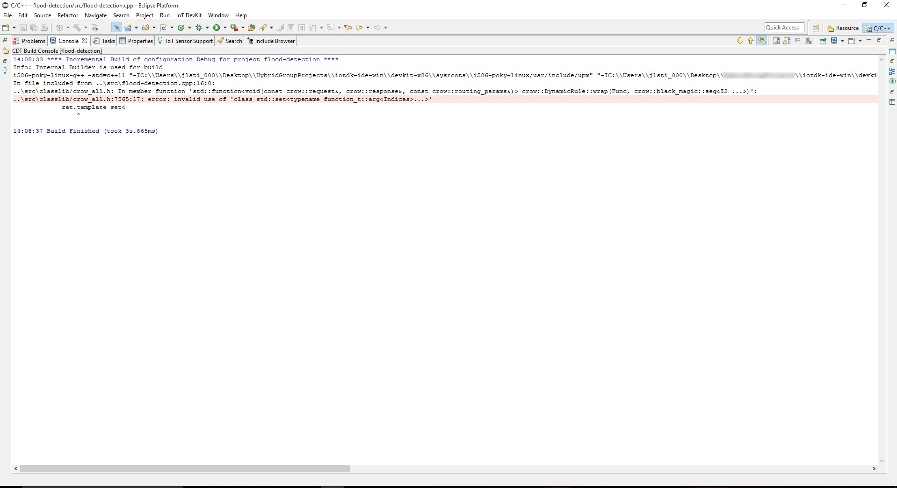
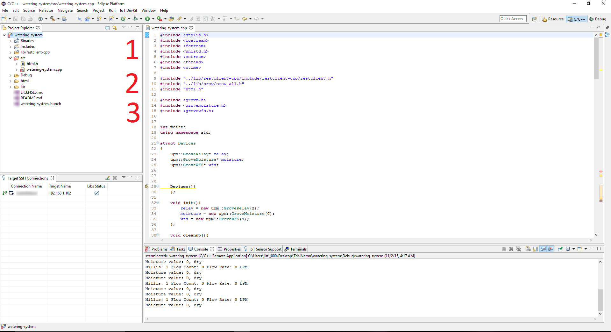

# Common Errors and Fixes 

A lot of errors may occure when using this software and hardware expecially for the first time. This tutorial is to help with the most common errors.

### CMD is not recognized as an internal or external command.

This is caused by the compiler attempting to run your program localy instead of on the edison itself. 

1. Click on run->run configuration.

2. Under connetion click on your device. In the example my device is JustinEdison.

### Connection timed out
This happens when the connection to the edison is interupted.

1. Right click on your device in the lower left hand corner and click connect. 

### File system input/output error
This usually happens when your edison is running your program and you attempt another upload. 

1. Simply stop the program in the Eclipse* IDE
2. Run the program again.
3. If the program is still not uploading unplug the edison and plug it back in. Then reconnect and rund the program again.

### Sensor could not be resolved
This usually happens when you do not have the correct libraries selected for the edison.

1. Make sure you have the proper include headers included in your program.

2. Go to Project->Properties->C\C++ Build

3. Under the Tool Setting tab go to Cross G++ Linker->Libraries

4. Click the add symbol and add the name of the library you need respectfully. 
Intel has some great documentation on their librarie here. http://iotdk.intel.com/docs/master/upm/modules.html

### Errors with API libraries such as crow and rest
The crow and rest libraries do work and compile. If you are getting errors please check the organization of headers and the previous library documentation. Be sure to in clude correctly. 

1. Be sure to have your standard libraries included first.

2. Then include your rest, crow and html.h headers.
3. Last include your sensor headers. 
