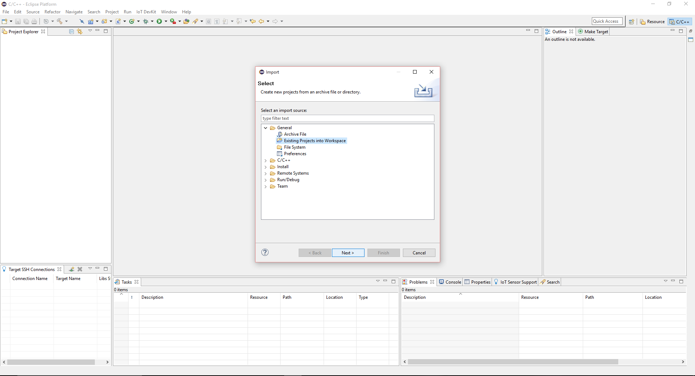

# Earthquake detector

## Introduction

This earthquake detector application is part of a series of how-to Intel IoT code sample exercises using the Intel® IoT Developer Kit, Intel® Edison board, cloud platforms, APIs, and other technologies.

From this exercise, developers will learn how to:

- Connect the Intel® Edison board, a computing platform designed for prototyping and producing IoT and wearable computing products.
- Interface with the Intel® Edison board IO and sensor repository using MRAA and UPM from the Intel® IoT Developer Kit, a complete hardware and software solution to help developers explore the IoT and implement innovative projects.
- Run these code samples in the Intel® System Studio IoT Edition (Eclipse\* IDE for C/C++ and Java\* development) for creating applications that interact with sensors and actuators, enabling a quick start for developing software for the Intel® Edison or Intel® Galileo board.
- Invoke the services of the United States Geological Survey\* (USGS\*) API for accessing earthquake data.

## What it is

Using an Intel® Edison board, this project lets you create an earthquake detector that:

- senses motion using a digital accelerometer;
- checks live earthquake data, using the USGS* API;
- displays an earthquake warning on the LCD;

## How it works

This earthquake detector constantly reads the 3-axis digital accelerometer looking for movement that could indicate an earthquake.

When it thinks it detects an earthquake, it attempts to verify, using the USGS\* API, that an earthquake actually occurred.

If so, it uses the LCD to issue a warning.

## Hardware requirements

Grove* Starter Kit containing:

1. Intel® Edison board with an Arduino* breakout board
2. Grove* Base Shield V2
3. [Grove* 3-Axis Digital Accelerometer](http://iotdk.intel.com/docs/master/upm/node/classes/mma7660.html)
4. [Grove* RGB LCD](http://iotdk.intel.com/docs/master/upm/node/classes/jhd1313m1.html)

## Software requirements

1. [Eclipse*](https://software.intel.com/en-us/eclipse-getting-started-guide)

## How to set up

To begin, clone the **How-To Intel IoT Code Samples** repository with Git* on your computer as follows:

    $ git clone https://github.com/intel-iot-devkit/intel-iot-examples.git

Want to download a .zip file? In your web browser, go to [https://github.com/intel-iot-devkit/intel-iot-examples](https://github.com/intel-iot-devkit/intel-iot-examples) and click the **Download ZIP** button at the lower right. Once the .zip file is downloaded, uncompress it, and then use the files in the directory for this example.

### Adding the program to Eclipse*

In Eclipse*, select **Import Wizard** to import an existing project into the workspace as follows:

1. From the main menu, select **File > Import**. 

2. The **Import Wizard** dialog box opens. Select **General > Existing Project into Workspace** and click **Next**. 

3. Click **Select root directory** and then the associated **Browse** button to locate the directory that contains the project files. 

4. Under **Projects**, select the directory with the project files you'd like to import and click **OK** and then **Finish** to import the files into Eclipse*. 

5. Your main .cpp program is now displayed in your workspace under the **src** folder. 

### Connecting the Grove* sensors

You need to have the Grove* Base Shield V2 connected to an Arduino\*-compatible breakout board to plug all the Grove* devices into the Grove* Base Shield V2. Make sure you have the tiny VCC switch on the Grove* Base Shield V2 set to **5V**.

1. Plug one end of a Grove* cable into the Grove* Accelerometer, and connect the other end to any of the I2C ports on the Grove* Base Shield V2. 

2. Plug one end of a Grove* cable into the Grove* RGB LCD, and connect the other end to any of the I2C ports on the Grove* Base Shield V2.

### Intel® Edison board setup

This example uses the **restclient-cpp** library to perform REST calls to the remote data server. The code can be found in the **lib** directory. The **restclient-cpp** library requires the **libcurl** package, which is already installed on the Intel® Edison board by default.

### Connecting your Intel® Edison board to Eclipse*

1. In the bottom left corner, right-click anywhere on the **Target SSH Connections** tab and select **New > Connection**. 

2. The **Intel(R) IoT Target Connection** window appears. In the **Filter** field, type the name of your board. 

3. In the **Select one of the found connections** list, select your device name and click **OK**. 

4. On the **Target SSH Connections** tab, right-click your device and select **Connect**. 

If prompted for the username and password, the username is **root** and the password is whatever you specified when configuring the Intel® Edison board.

### Running the code on the Intel® Edison board

When you're ready to run the example, click **Run** at the top menu bar in Eclipse*. 

This compiles the program using the Cross G++ Compiler, links it using the Cross G++ Linker, transfers the binary to the Intel® Edison board, and then executes it on the board itself.

After running the program, you should see output similar to the one in the image below. 

When the the program loads correctly, your Grove* RGB LCD shows the `quakebot ready` message. 

If you shake the accelerometer, it checks to see if there really was an earthquake.
