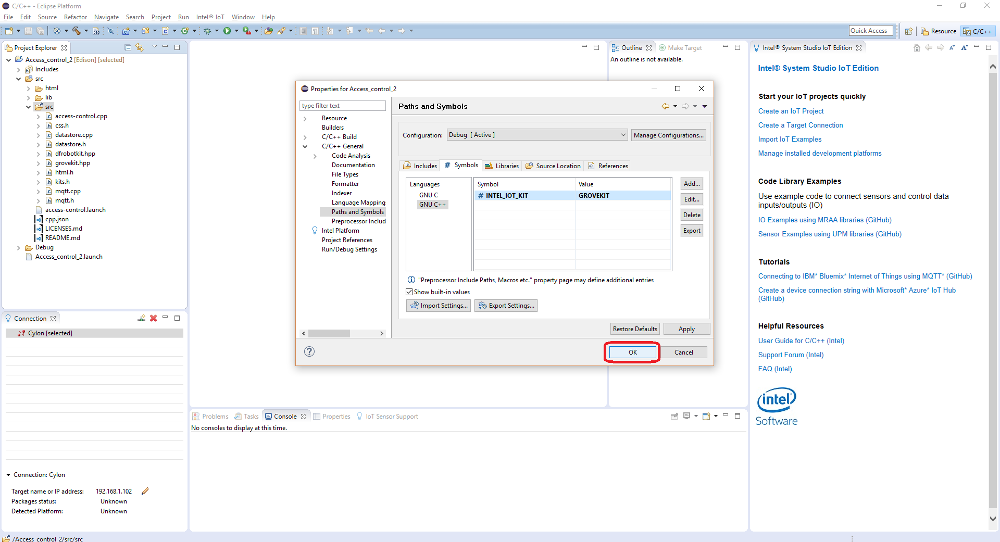

# Earthquake detector in C++

## What it is

Using a compatible Intel-based platform, this project lets you create an earthquake detector that:

- senses motion using a digital accelerometer.
- checks live earthquake data, using the USGS API.
- displays an earthquake warning on the LCD.

## First time setup
For all the samples in this repository, see the  for required boards and libraries.  You need either Grove or DFRobot sensors but not both.

## Hardware requirements

### Grove\*

Sensor | Pin
--- | ---
Grove\* 3-Axis Digital Accelerometer | I2C
Grove\* RGB LCD | I2C

### DFRobot\*

Sensor | Pin
--- | ---
One end of a DFRobot\* cable into the plug labeled "X" on the Triple-Axis Accelerometer | A1
One end of a DFRobot\* cable into the plug labeled "Y" on the Triple-Axis Accelerometer | A2
One end of a DFRobot\* cable into the plug labeled "Z" on the Triple-Axis Accelerometer | A3

For more specific information on the hardware requirements see 

## Software requirements

1.  and 
Note: The following libraries are included with the repo and already linked to in the code -jsoncpp -restclient
2. Intel® System Studio  

## Configuring the example for your hardware kit

To configure the example for the specific hardware kit that you are using, either Grove\* or DFRobot\*:

1. From the main menu, select **Project > Properties** dialog box is displayed.

2. Expand the section **C/C++ General**. <br>Click on the **Paths and Symbols** sub-section, and click on the **Symbols** tab.

3. Now click on **GNU C++**, and click on the **Add** button.

4. In the **Name** field, enter "INTEL_IOT_KIT". In the **Value** field, enter either "GROVEKIT" (this is the default) or "DFROBOTKIT", depending on which hardware kit you wish to use.

5. Your new name symbol and value will now be displayed. Click **OK**.

6. Another dialog box will appear asking to rebuild project. Click **OK**.


You will see output similar to below when the program is running.

```
Checking... 
No quake. 
```

When the the program loads correctly, your Grove\* RGB LCD shows the `quakebot ready` message.<br>


If you shake the accelerometer, the detector checks to see if there really was an earthquake.

IMPORTANT NOTICE: This software is sample software. It is not designed or intended for use in any medical, life-saving or life-sustaining systems, transportation systems, nuclear systems, or for any other mission-critical application in which the failure of the system could lead to critical injury or death. The software may not be fully tested and may contain bugs or errors; it may not be intended or suitable for commercial release. No regulatory approvals for the software have been obtained, and therefore software may not be certified for use in certain countries or environments.
