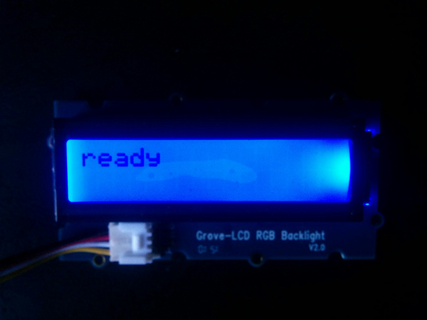

# Equipment Activity Monitor in C++

## What it is

Using a compatible Intel® IoT Platform, this project lets you create a shop-floor equipment activity monitor that: 
- tracks equipment usage by monitoring sound and vibration sensors. 
- issues a visual notification whenever the equipment is in use. 
- logs equipment usage using cloud-based data storage.

## First time setup
For all the samples in this repository, see the  for required boards and libraries.  You need either Grove or DFRobot sensors but not both.

### Grove
Sensor | Pin
--- | ---
Grove\* Sound Sensor | A0
Grove\* Piezo Vibration Sensor | A2
Grove\* RGB LCD | I2C

### DFRobot
Sensor | Pin
--- | ---
Analog Sound Sensor | A1
Digital Vibration Sensor | A2

For more specific information on the hardware requirements see 

## Software requirements

1.  and  
2. Microsoft Azure\*, IBM Bluemix\*, AT&T M2X\*, AWS\*, Predix\*, or SAP\* account (optional)
3. Note: The following libraries are included with the repo and already linked to in the code 
  -jsoncpp
  -restclient

## Configuring the example

The type of kit (Grove or DFRobot) can be configured in the  file.

Specific pin setup and timing can be configured in the respsective  and  files.

## Running the program

To run this example on the board, simply enter

    $ make
    $ build
    $ ./equipment-activity

The LCD should now display `ready`. 

## Running the example with the cloud server

To run the example with the optional backend data store, you need to set the `SERVER` and `AUTH_TOKEN` environment variables. You can do this in Eclipse as follows:

1. From the **Run** menu, select **Run Configurations**.  The **Run Configurations** dialog box is displayed.
2. Under **C/C++ Remote Application**, click **doorbell**.  This displays the information for the application.
3. In the **Commands to execute before application** field, add the following environment variables, except use the server and authentication token that correspond to your own setup: 

        chmod 755 /tmp/equipment-activity;export SERVER="http://intel-examples.azurewebsites.net/logger/equipment-activity"; export AUTH_TOKEN="YOURTOKEN"

4. Click **Apply** to save your new environment variables.

Now when you run your program using the **Run** button, it should be able to call your server to save the data right from the Intel® IoT Platform.

IMPORTANT NOTICE: This software is sample software. It is not designed or intended for use in any medical, life-saving or life-sustaining systems, transportation systems, nuclear systems, or for any other mission-critical application in which the failure of the system could lead to critical injury or death. The software may not be fully tested and may contain bugs or errors; it may not be intended or suitable for commercial release. No regulatory approvals for the software have been obtained, and therefore software may not be certified for use in certain countries or environments.
