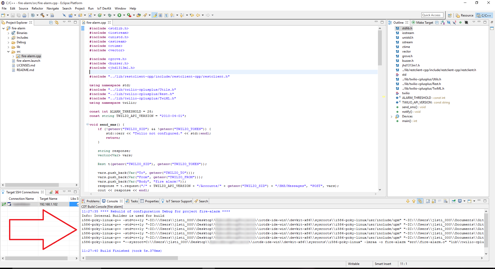

# **DEPRECATED** Field data reporter in C++

## Introduction

**Please note that this sample has been deprecated and is no longer supported.**

This wrist field data reporter application is part of a series of how-to Internet of Things (IoT) code sample exercises using the Intel® IoT Developer Kit, Intel® Edison board, cloud platforms, APIs, and other technologies.

From this exercise, developers will learn how to:

- Connect the Intel® Edison board, a computing platform designed for prototyping and producing IoT and wearable computing products.
- Interface with the Intel® Edison board IO and sensor repository using MRAA and UPM from the Intel® IoT Developer Kit, a complete hardware and software solution to help developers explore the IoT and implement innovative projects.
- Run these code samples in the Intel® System Studio IoT Edition (Eclipse IDE for C/C++ and Java\* development) for creating applications that interact with sensors and actuators, enabling a quick start for developing software for the Intel® Edison board or the Intel® Galileo board.
- Set up a web application server to view data using a web page served up directly from the Intel® Edison board.

## What it is

Using an Intel® Edison board, this project lets you create a wrist field data reporter that:

- continuously monitors the data read from the digital barometer.
- displays latest readings using the OLED display, when the touch sensor is tapped.
- serves up the recorded data in the JSON format directly from the Intel® Edison board.

## How it works

This wrist field data recorder can be used to sample barometer data at regular intervals.

It also provides a way to look at the latest data captured, using the QTouch\* sensor and the OLED display.

These readings can be viewed or downloaded as JSON data served up directly from an embedded web server running on the Intel® Edison board.

## Hardware requirements

Xadow* Starter Kit containing:

1. Intel® Edison board with a Xadow expansion board
2. [Xadow - OLED display](http://iotdk.intel.com/docs/master/upm/node/classes/ssd1308.html)
3. [Xadow - QTouch*](http://iotdk.intel.com/docs/master/upm/node/classes/at42qt1070.html)
4. [Xadow - BMP180](http://iotdk.intel.com/docs/master/upm/node/classes/bmpx8x.html)

## Software requirements

1. [Intel® System Studio (Eclipse IDE for C/C++ and Java* development)](https://software.intel.com/en-us/node/672439)

### How to set up

This sample is already one of the IoT examples included in Intel® System Studio. To start using it, follow these steps:

1. From the main menu, select **Intel® IoT > Import IoT Examples**. 

2. Expand the tree view for **C++ > How To Code Samples > Feild Data Reporter** and click **Import Example**. 

3. Select your developer board from the selection window then select **Next**. 

4. Select **Intel® IoT C/C++ project** from the Select a project type window then click **Next**. 

5. Select **Yocto** from the Selct target OS dropdown menu then click **Next**. 

6. The next tab will ask for connection name and target name. If you do not know these click **Search Target**. 

7. Select your Edison from the dropdown list. Select **OK**. 

8. Your connection name and target name should be filled in. Select **Finish**. 

9. A new window will open for you and you will need to choose a name for your project and click **Next**. 

10. Your project source files will now be available on the on the upper left of your IDE by default. 

### Connecting the Xadow* sensors

You need to have a Xadow* expansion board connected to the Intel® Edison board to plug in all the Xadow devices.

1. Plug one end of a Xadow connector into the Xadow OLED, and connect the other end to one of the side connectors on the Xadow expansion board. 

2. Plug one end of a Xadow connector into the Xadow BMP180, and connect the other end to one of the side connectors on the Xadow expansion board.
3. Plug one end of a Xadow connector into the Xadow QTouch* sensor, and connect the other end to one of the other two connected devices.

### Connecting your Intel® Edison board to Intel® System Studio

1. On the **Target SSH Connections** tab, right-click your device and select **Connect**. 

If prompted for the username and password, the username is **root** and the password is whatever you specified when configuring the Intel® Edison board.

### Running the code on the Intel® Edison board

When you're ready to run the example, click **Run** at the top menu bar in Intel® System Studio. 

This compiles the program using the Cross G++ Compiler, links it using the Cross G++ Linker, transfers the binary to the Intel® Edison board, and then executes it on the board itself.

After running the program, you should see output similar to the one in the image below. 

When the program uploads to the Intel® Edison board, your OLED display shows the current barometer reading when you touch any of the QTouch* buttons. 

### Data access via a browser

The data collected can be downloaded as JSON directly via a web page served by the sample program running on the Intel® Edison board. 

The web server runs on port `3000`; if the Intel® Edison board is connected to WiFi* on `192.168.1.13`, the address to browse to if you are on the same network is `http://192.168.1.13:3000`.

IMPORTANT NOTICE: This software is sample software. It is not designed or intended for use in any medical, life-saving or life-sustaining systems, transportation systems, nuclear systems, or for any other mission-critical application in which the failure of the system could lead to critical injury or death. The software may not be fully tested and may contain bugs or errors; it may not be intended or suitable for commercial release. No regulatory approvals for the software have been obtained, and therefore software may not be certified for use in certain countries or environments.
