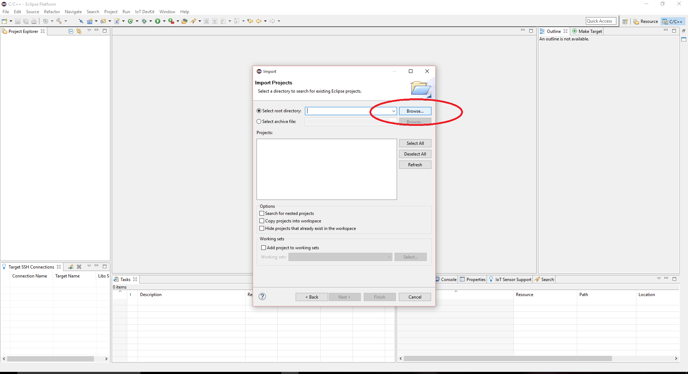
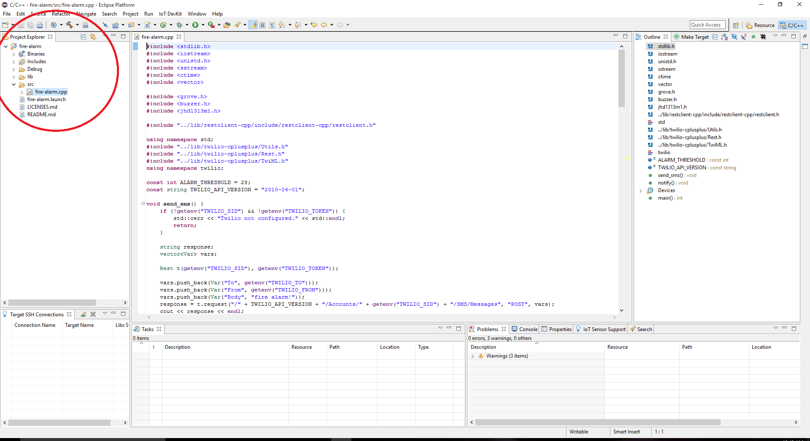
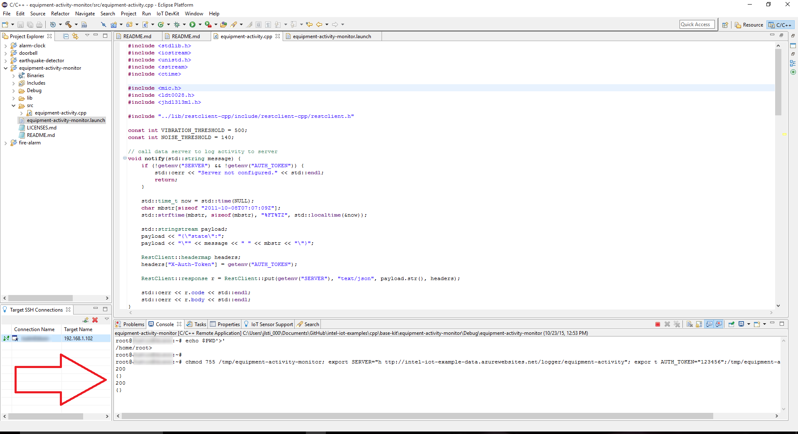
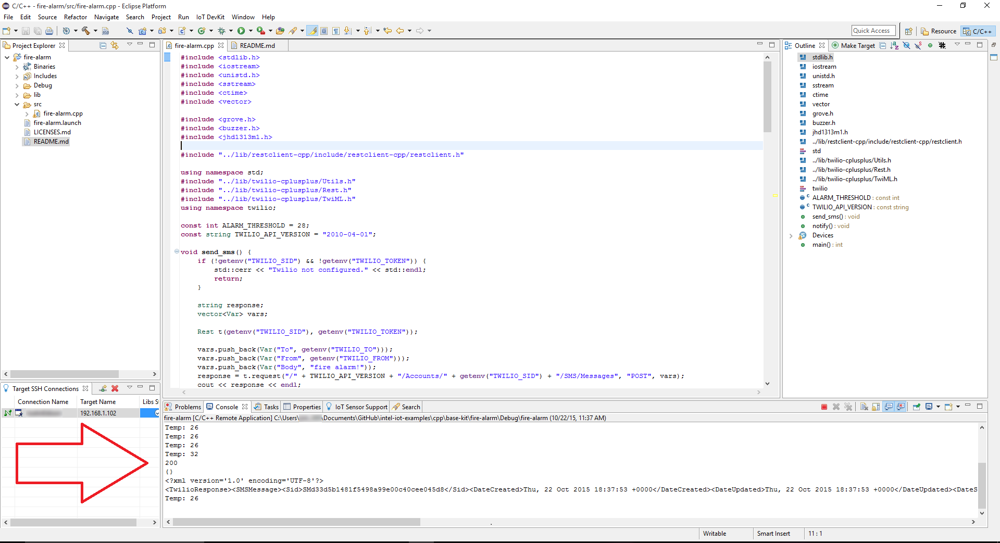

# Fire alarm in C++

## Introduction

This smart fire alarm application is part of a series of how-to Intel® IoT code sample exercises using the Intel® IoT Developer Kit, Intel® Edison board, cloud platforms, APIs, and other technologies.

From this exercise, developers will learn how to:

- Connect the Intel® Edison board, a computing platform designed for prototyping and producing IoT and wearable computing products.
- Interface with the Intel® Edison board IO and sensor repository using MRAA and UPM from the Intel® IoT Developer Kit, a complete hardware and software solution to help developers explore the IoT and implement innovative projects.
- Run these code samples in the Intel® System Studio IoT Edition (Eclipse\* IDE for C/C++ and Java\* development) for creating applications that interact with sensors and actuators, enabling a quick start for developing software for the Intel® Edison or Intel® Galileo board.
- Set up a web application server to store fire alarm data using Azure Redis Cache\* from Microsoft\* Azure\*, Redis Store\* from IBM\* Bluemix\*, or ElastiCache\* using Redis\* from Amazon\* Web Services\* (AWS\*), different cloud services for connecting IoT solutions including data analysis, machine learning, and a variety of productivity tools to simplify the process of connecting your sensors to the cloud and getting your IoT project up and running quickly.
- Invoke the services of the Twilio\* API for sending text messages.
- Set up a MQTT-based server using IoT Hub\* from Microsoft\* Azure\*, IoT\* from IBM\* Bluemix\*, or IoT\* from Amazon\* Web Services\* (AWS\*), different cloud machine to machine messaging services based on the industry standard MQTT protocol.

## What it is

Using an Intel® Edison board, this project lets you create a smart fire alarm that:

- constantly monitors for unsafe temperature levels;
- audibly notifies of alerts using the buzzer;
- visually notifies of alerts using the LCD;
- keeps track of fire alarm data, using cloud-based storage;
- sends text messages to alert others of a possible fire.

## How it works

This smart fire alarm monitors the ambient temperature using the Grove* Temperature Sensor.

If the temperature is above a certain threshold (set to 28 degrees Celsius for this example), it sounds an alarm through the buzzer and displays an alert on the LCD.

In addition, it can send an SMS to a specified number through Twilio*, warning them of a possible fire danger.

Optionally, it can also log fire events using the Intel IoT Examples Datastore or an MQTT server running in your own Microsoft\* Azure\*, IBM\* Bluemix\*, or AWS\* account.

## Hardware requirements

Grove* Starter Kit containing:

1. Intel® Edison board with an Arduino* breakout board
2. Grove* Base Shield V2
3. [Grove* Temperature Sensor](http://iotdk.intel.com/docs/master/upm/node/classes/grovetemp.html)
4. [Grove* Buzzer](http://iotdk.intel.com/docs/master/upm/node/classes/buzzer.html)
5. [Grove* RGB LCD](http://iotdk.intel.com/docs/master/upm/node/classes/jhd1313m1.html)

## Software requirements

1. [Intel® System Studio IoT Edition (Eclipse* IDE for C/C++ and Java* development)](https://software.intel.com/en-us/eclipse-getting-started-guide)
2. Microsoft\* Azure\*, IBM\* Bluemix\*, or AWS\* account
3. Twilio\* account

## How to set up

To begin, clone the **How-To Intel IoT Code Samples** repository with Git* on your computer as follows:

    $ git clone https://github.com/intel-iot-devkit/how-to-code-samples.git

Want to download a .zip file? In your web browser, go to [https://github.com/intel-iot-devkit/how-to-code-samples](https://github.com/intel-iot-devkit/how-to-code-samples) and click the **Download ZIP** button at the lower right. Once the .zip file is downloaded, uncompress it, and then use the files in the directory for this example.

### Adding the program to Eclipse*

In Eclipse\*, select **Import Wizard** to import an existing project into the workspace as follows:

1. From the main menu, select **File > Import**. 

2. The **Import Wizard** dialog box opens. Select **General > Existing Project into Workspace** and click **Next**. 

3. Click **Select root directory** and then the associated **Browse** button to locate the directory that contains the project files. 

4. Under **Projects**, select the directory with the project files you'd like to import and click **OK** and then **Finish** to import the files into Eclipse*. 

5. Your main .cpp program is now displayed in your workspace under the **src** folder. 

### Connecting the Grove* sensors

You need to have the Grove* Base Shield V2 connected to an Arduino\*-compatible breakout board to plug all the Grove* devices into the Grove* Base Shield V2. Make sure you have the tiny VCC switch on the Grove* Base Shield V2 set to **5V**.

1. Plug one end of a Grove* cable into the Grove* Temperature Sensor, and connect the other end to the A0 port on the Grove* Base Shield V2. 

2. Plug one end of a Grove* cable into the Grove* Buzzer, and connect the other end to the D5 port on the Grove* Base Shield V2.
3. Plug one end of a Grove* cable into the Grove* RGB LCD, and plug the other end into any of the I2C ports on the Grove* Base Shield V2.

### Intel® Edison board setup

This example uses the **restclient-cpp** library to perform REST calls to the remote data server. The code can be found in the **lib** directory. The **restclient-cpp** library requires the **libcurl** package, which is already installed on the Intel® Edison board by default.

In addition, this example uses the **twilio-cplusplus** library to perform REST calls to the Twilio* SMS server. The code for **twilio-cplusplus** can be found in the **lib** directory. The **twilio-cplusplus** library requires the **ssl** and **crypto** packages, which are already installed on the Intel® Edison board by default.

### Twilio* API Key

To optionally send text messages, you need to register for an account and get an API key from the Twilio* web site:

[https://www.twilio.com](https://www.twilio.com)

You cannot send text messages without obtaining a Twilio* API key first. You can still run the example, but without SMS alerts.

### Datastore server setup

Optionally, you can store the data generated by this sample program in a backend database deployed using Microsoft\* Azure\*, IBM* Bluemix\*, or AWS\*, along with Node.js\*, and a Redis\* data store.

For information on how to set up your own cloud data server, go to:

[https://github.com/intel-iot-devkit/intel-iot-examples-datastore](https://github.com/intel-iot-devkit/intel-iot-examples-datastore)

### MQTT server setup

You can also optionally store the data generated by this sample program using [MQTT](http://mqtt.org/), a Machine To Machine messaging server. You can use MQTT to connect to Microsoft\* Azure\*, IBM\* Bluemix\*, or AWS\*.

For information on how to connect to your own cloud MQTT messaging server, go to:

[https://github.com/intel-iot-devkit/intel-iot-examples-mqtt](https://github.com/intel-iot-devkit/intel-iot-examples-mqtt)

### Connecting your Intel® Edison board to Eclipse*

1. In the bottom left corner, right-click anywhere on the **Target SSH Connections** tab and select **New > Connection**. 

2. The **Intel(R) IoT Target Connection** window appears. In the **Filter** field, type the name of your board. 

3. In the **Select one of the found connections** list, select your device name and click **OK**. 

4. On the **Target SSH Connections** tab, right-click your device and select **Connect**. 

If prompted for the username and password, the username is **root** and the password is whatever you specified when configuring the Intel® Edison board.

### Running the example with the cloud server

To run the example with the optional backend data store, you need to set the `SERVER` and `AUTH_TOKEN` environment variables. You can do this in Eclipse* as follows:

1. From the **Run** menu, select **Run Configurations**.  The **Run Configurations** dialog box is displayed.
2. Under **C/C++ Remote Application**, click **doorbell**.  This displays the information for the application.
3. In the **Commands to execute before application** field, add the environment variables so it looks like this, except using the server and authentication token that correspond to your own setup:

        chmod 755 /tmp/fire-alarm; export SERVER="http://intel-iot-example-data.azurewebsites.net/logger/fire-alarm"; export AUTH_TOKEN="Enter Auth Token Here"; export TWILIO_SID="Enter Twilio SID Here"; export TWILIO_TOKEN="Enter Twilio Token Here"; export TWILIO_TO="Enter Number to Send to here Formattted 555-555-5555"; export TWILIO_FROM="Enter Number to be Sent From Here Formated 555-555-5555"

4. Click **Apply** to save your new environment variables.

Now, when you run your program using the **Run** button, it should be able to call your server to save the data right from the Intel® Edison board.

### Running the code on the Intel® Edison board

When you're ready to run the example, click **Run** at the top menu bar in Eclipse*. 

This compiles the program using the Cross G++ Compiler, links it using the Cross G++ Linker, transfers the binary to the Intel® Edison board, and then executes it on the board itself.

After running the program, you should see output similar to the one in the image below. 

Successful output should be similar to the one in the image below. 

When the program is uploaded to the Intel® Edison board, the program starts to continuously monitor the temperature. If it exceeds the threshold, the `Fire Alarm!` message is displayed on the LCD. 

When the temperature sensor is heated, another output message is displayed in the Eclipse* console, similarly to the image above. This means you successfully sent your SMS alert. 

IMPORTANT NOTICE: This software is sample software. It is not designed or intended for use in any medical, life-saving or life-sustaining systems, transportation systems, nuclear systems, or for any other mission-critical application in which the failure of the system could lead to critical injury or death. The software may not be fully tested and may contain bugs or errors; it may not be intended or suitable for commercial release. No regulatory approvals for the software have been obtained, and therefore software may not be certified for use in certain countries or environments.
