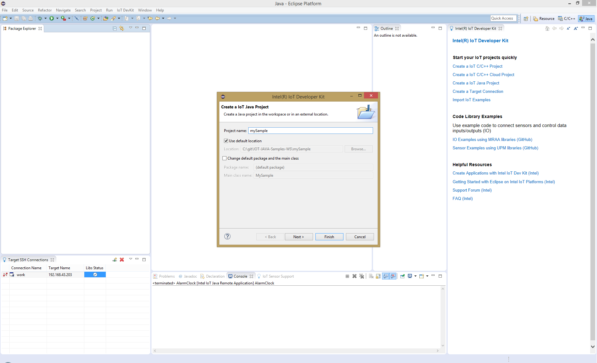
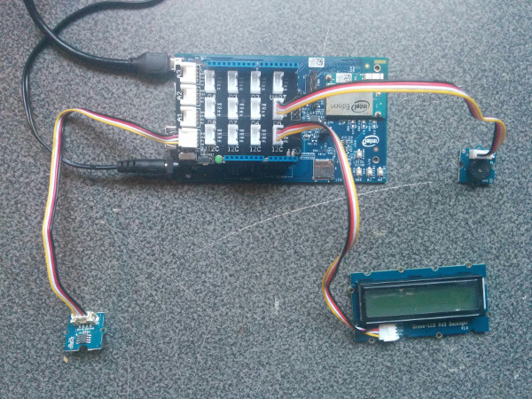

# Fire alarm

## Introduction

This smart fire alarm application is part of a series of how-to Intel IoT code sample exercises using the Intel® IoT Developer Kit, Intel® Edison development platform, cloud platforms, APIs, and other technologies.

From this exercise, developers will learn how to:<br>
- Connect the Intel® Edison development platform, a computing platform designed for prototyping and producing IoT and wearable computing products.<br>
- Interface with the Intel® Edison platform IO and sensor repository using MRAA and UPM from the Intel® IoT Developer Kit, a complete hardware and software solution to help developers explore the IoT and implement innovative projects.<br>
- Run this code sample in Intel® System Studio IoT Edition . Intel® System Studio IoT Edition lets you create and test applications on Intel®-based IoT platforms.<br>
- Invoke the services of the Twilio* API for sending text messages.

## What it is

Using an Intel® Edison board, this project lets you create a smart fire alarm that:<br>
- constantly monitors for unsafe temperature levels;<br>
- issues an audible notification using the buzzer;<br>
- issues a visual notification using the LCD;<br>
- keeps track of fire events, using cloud-based data storage;<br>
- sends text messages to alert others of a possible fire.

## How it works

This smart fire alarm monitors the ambient temperature using the Grove* Temperature Sensor.

If the temperature exceeds a certain threshold (set to 27 degrees Celsius in this example), it sounds an alarm through the buzzer and displays an alert on the LCD.

In addition, it can send a text message to a specified number through Twilio*, warning the recipient of a possible fire danger.

Optionally, it can log fire events using the Intel IoT Examples Datastore running in your own Microsoft* Azure* account.

## Hardware requirements

Grove* Starter Kit Plus containing:

1. Intel® Edison with an Arduino* breakout board
2. [Grove* Temperature Sensor](http://iotdk.intel.com/docs/master/upm/node/classes/grovetemp.html)
3. [Grove* Buzzer](http://iotdk.intel.com/docs/master/upm/node/classes/buzzer.html)
4. [Grove* RGB LCD](http://iotdk.intel.com/docs/master/upm/node/classes/jhd1313m1.html)


## Software requirements

1. Intel® System Studio IoT Edition
2. Microsoft* Azure* account
3. Twilio* account

### How to set up

To begin, clone the **How-To Intel IoT Code Samples** repository with Git* on your computer as follows:

    $ git clone https://github.com/intel-iot-devkit/how-to-code-samples.git

Want to download a .zip file? In your web browser, go to <a href="https://github.com/intel-iot-devkit/how-to-code-samples">https://github.com/intel-iot-devkit/how-to-code-samples</a> and click the **Download ZIP** button at the lower right. Once the .zip file is downloaded, uncompress it, and then use the files in the directory for this example.

## Adding the program to Intel® System Studio IoT Edition

 ** The following screenshots are from the Alarm clock sample, however the technique for adding the program is the same, just with different source files and jars. 

Open Intel® System Studio IoT Edition, it will start by asking for a workspace directory. Choose one and click OK.

In Intel® System Studio IoT Edition , select File -> new -> **Intel(R) IoT Java Project**:


Give the project the name "FireAlarm" and click Next.



You now need to connect to your Intel® Edison board from your computer to send code to it.
Choose a name for the connection and enter the Edison's IP address in the "Target Name" field. You can also try to Search for it using the "Search Target" button. Click finish when you are done.


You have successfully created an empty project. You now need to copy the source files and the config file to the project. 
Drag all of the files from your git repository's "src" folder into the new project's src folder in Intel® System Studio IoT Edition. Make sure previously auto-generated main class is overridden.

The project uses the following external jars: [gson-2.6.1](http://central.maven.org/maven2/com/google/code/gson/gson/2.6.1/gson-2.6.1.jar), [twilio-java-sdk-6.3.0-jar-with-dependencies](http://repo.maven.apache.org/maven2/com/twilio/sdk/twilio-java-sdk/6.3.0/twilio-java-sdk-6.3.0-jar-with-dependencies.jar). These can be found in the Maven Central Repository. Create a "jars" folder in the project's root directory, and copy all needed jars in this folder.
In Intel® System Studio IoT Edition, select all jar files in "jars" folder and  right click -> Build path -> Add to build path


Now you need to add the UPM jar files relevant to this specific sample.
right click on the project's root -> Build path -> Configure build path. Java Build Path -> 'Libraries' tab -> click on "add external JARs..."

for this sample you will need the following jars:

1. upm_buzzer.jar
2. upm_grove.jar
3. upm_i2clcd.jar

The jars can be found at the IOT Devkit installation root path\iss-iot-win\devkit-x86\sysroots\i586-poky-linux\usr\lib\java


### Connecting the Grove* sensors



You need to have a Grove* Shield connected to an Arduino\*-compatible breakout board to plug all the Grove* devices into the Grove* Shield. Make sure you have the tiny VCC switch on the Grove* Shield set to **5V**.

1. Plug one end of a Grove* cable into the Grove* Temperature Sensor, and connect the other end to the A0 port on the Grove* Shield.

2. Plug one end of a Grove* cable into the Grove* Buzzer, and connect the other end to the D5 port on the Grove* Shield.

3. Plug one end of a Grove* cable into the Grove* RGB LCD, and connect the other end to any of the I2C ports on the Grove* Shield.


### Datastore server setup

Optionally, you can store the data generated by this sample program in a backend database deployed using Microsoft* Azure*, IBM* Bluemix, or AWS, along with Node.js*, and a Redis* data store.

For information on how to set up your own cloud data server, go to:

<a href="https://github.com/intel-iot-devkit/intel-iot-examples-datastore">https://github.com/intel-iot-devkit/intel-iot-examples-datastore</a>


### Twilio* API key

To optionally send text messages, you need to register for an account and get an API key from the Twilio* web site:

<a href="https://www.twilio.com">https://www.twilio.com</a>

You cannot send text messages without obtaining a Twilio* API key first. You can still run the example, but without the text messages.

## Configuring the example

Pass your Twilio* API key and authentication token to the sample program by modifying the `TWILIO_ACCT_SID` and `TWILIO_AUTH_TOKEN` keys in the `config.properties`. 
`NUMBER_TO_SEND_TO` and `TWILIO_OUTGOING_NUMBER` are also part of the twilio setup.
'TEMPERATURE_THRESHOLD' defines the temperature threshold indicating a fire.

Also, to configure the example for the optional Microsoft* Azure* data store, change the `SERVER` and `AUTH_TOKEN` keys in the `config.properties` file as follows:

```

  TWILIO_ACCT_SID=ACdd1eb41a542da1a11f6680f949d1fa6d
  TWILIO_AUTH_TOKEN=9980bbd2b2fa97d0b918f6b788d4120d
  TWILIO_OUTGOING_NUMBER=323-555-1212
  NUMBER_TO_SEND_TO=213-555-1212
  SERVER=http://mySite.azurewebsites.net/logger/fire-alarm
  AUTH_TOKEN=myPassword
  TEMPERATURE_THRESHOLD=27

```


## Preparing Edison before running the project

In order for the sample to run you will need to copy some files to Edison. This can be done using SCP through SSH.

The files need to be copied from the sample repository: <br>
Jar files- external libraries in the project need to be copied to "/usr/lib/java"


## Running the program using Intel® System Studio IoT Edition

When you're ready to run the example, make sure you saved all the files.

Click the **Run** icon on the toolbar of Intel® System Studio IoT Edition. This runs the code on Intel® Edison.


### Determining the Intel® Edison IP address

You can determine what IP address Intel® Edison is connected to by running the following command:

    ip addr show | grep wlan

You will see the output similar to the following:

    3: wlan0: <BROADCAST,MULTICAST,UP,LOWER_UP> mtu 1500 qdisc pfifo_fast qlen 1000
        inet 192.168.1.13/24 brd 192.168.1.255 scope global wlan0

The IP address is shown next to `inet`. In the example above, the IP address is `192.168.1.13`.
