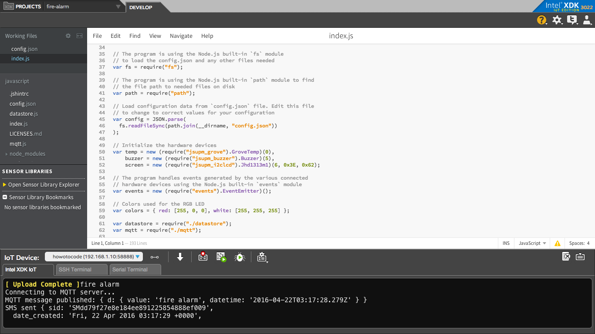

## What it is

Using a compatible Intel® IoT Platform, this project lets you create a smart fire alarm that:<br>
- constantly monitors for unsafe temperature levels.<br>
- issues an audible notification using the buzzer.<br>
- issues a visual notification using the LCD.<br>
- keeps track of fire events, using cloud-based data storage.<br>
- sends text messages to alert others of a possible fire.

## First time setup  
For all the samples in this repository, see the  for required boards and libraries. You need either Grove or DFRobot sensors but not both.

## Hardware requirements

### Grove\*

You need to have a Grove\* Shield connected to an Arduino\* compatible breakout board to plug all the Grove\* devices into the Grove\* Shield. Make sure you have the tiny VCC switch on the Grove\* Shield set to **5V**.

Sensor | Pin
--- | ---
Grove\* Temperature Sensor | A0
Grove\* Buzzer | D5
Grove\* RGB LCD | I2C

### DFRobot\*

You need to have a LCD Keypad Shield connected to an Arduino\* compatible breakout board to plug all the DFRobot\* devices into the LCD Keypad Shield.

Sensor | Pin
--- | ---
Analog Temperature Sensor | A3
Buzzer | A2

More details on the hardware requirements can be found in the 

## Software requirements

1.  and  
1. Node.js 
2. MRAA and UPM Node.js bindings <link to mraa and upm install docs>
2. Packages as listed in the package.json file in this example 
2. Microsoft Azure\*, IBM Bluemix\*, AT&T M2X\*, AWS\*, Predix\*, or SAP\* account (optional)
3. Twilio\* account (optional)

### Twilio\* API key

To optionally send text messages, you need to register for an account and get an API key from the Twilio\* website:

<a href="https://www.twilio.com">https://www.twilio.com</a>

You cannot send text messages without obtaining a Twilio API key first. You can still run the example, but without the text messages.

Pass your Twilio\* API key and authentication token to the sample program by modifying the `TWILIO_ACCT_SID` and `TWILIO_AUTH_TOKEN` keys in the `config.json` file as follows:

```
{
  "ALARM_THRESHOLD": 28,
  "TWILIO_ACCT_SID": "YOURAPIKEY",
  "TWILIO_AUTH_TOKEN": "YOURTOKEN"
}
```

## Configuring the example

To configure the example for the Grove\* kit, just leave the `kit` key in the `config.json` set to `grove`. To configure the example for the DFRobot\* kit, change the `kit` key in the `config.json` to `dfrobot` as follows:

```
{
  "kit": "dfrobot",
  "ALARM_THRESHOLD": 28
}
```

To configure the example for the Arduino 101, add a `platform` key with the value `firmata` to the `config.json`, as follows:

```
{
  "kit": "grove",
  "platform": "firmata",
  "ALARM_THRESHOLD": 28
}
```

To configure the example for sending optional text messages, obtain an API key from the Twilio\* web site as explained above, and then add the `TWILIO_ACCT_SID` and `TWILIO_AUTH_TOKEN` keys to the `config.json` file as follows:

```
{
  "kit": "grove",
  "ALARM_THRESHOLD": 28,
  "TWILIO_ACCT_SID": "YOURAPIKEY",
  "TWILIO_AUTH_TOKEN": "YOURTOKEN"
}
```

To configure the example for the optional Microsoft Azure\*, IBM Bluemix\*, or AWS data store, add the `SERVER` and `AUTH_TOKEN` keys in the `config.json` file as follows:

```
{
  "kit": "grove",
  "ALARM_THRESHOLD": 28,
  "SERVER": "http://intel-examples.azurewebsites.net/logger/fire-alarm",
  "AUTH_TOKEN": "s3cr3t"
}
```

To configure the example for both the text messages and the Microsoft Azure\*, IBM Bluemix\*, or AWS data store, add the `TWILIO_ACCT_SID`, `TWILIO_AUTH_TOKEN`, `SERVER`, and `AUTH_TOKEN` keys in the `config.json` file as follows:

```
{
  "kit": "grove",
  "ALARM_THRESHOLD": 28,
  "TWILIO_ACCT_SID": "YOURAPIKEY",
  "TWILIO_AUTH_TOKEN": "YOURTOKEN",
  "SERVER": "http://intel-examples.azurewebsites.net/logger/fire-alarm",
  "AUTH_TOKEN": "s3cr3t"
}
```

For information on how to configure the example for an optional Microsoft Azure\*, IBM Bluemix\*, AT&T M2X\*, AWS\*, Predix\*, or SAP\* IoT cloud server, go to:

[https://github.com/intel-iot-devkit/iot-samples-cloud-setup](https://github.com/intel-iot-devkit/iot-samples-cloud-setup)

## Running the program 

To run this example on the board, simply enter

    $ npm install
    $ npm run
    $ ./fire-alarm
    
You will see output similar to below when the program is running.

```
[Upload Complete] fire alarm 
Connecting to MQTT server... 
MQTT message published: { d: { value: 'fire alarm', datetime: '2016-04-22T03:17:28.279Z' } } 
SMS sent { sid: 'SMdd79f27e8e184ee891225854888ef009', 
date_created: 'Fri, 22 Apr 2016 03:17:29 +0000', 
```


Refer to  for details on the functionality.
    
### IoT cloud setup (optional)

You can optionally store the data generated by this sample program using cloud-based IoT platforms from Microsoft Azure\*, IBM Bluemix\*, AT&T M2X\*, AWS\*, Predix\*, or SAP\*.

For information on how to connect to your own cloud server, go to:

[https://github.com/intel-iot-devkit/iot-samples-cloud-setup](https://github.com/intel-iot-devkit/iot-samples-cloud-setup)

### Data store server setup (optional)

Optionally, you can store the data generated by this sample program in a back-end database deployed using Microsoft Azure\*, IBM Bluemix\*, or AWS, along with Node.js\*, and a Redis\* data store.

For information on how to set up your own cloud data server, go to:

[https://github.com/intel-iot-devkit/intel-iot-examples-datastore](https://github.com/intel-iot-devkit/intel-iot-examples-datastore)

IMPORTANT NOTICE: This software is sample software. It is not designed or intended for use in any medical, life-saving or life-sustaining systems, transportation systems, nuclear systems, or for any other mission-critical application in which the failure of the system could lead to critical injury or death. The software may not be fully tested and may contain bugs or errors; it may not be intended or suitable for commercial release. No regulatory approvals for the software have been obtained, and therefore software may not be certified for use in certain countries or environments.
