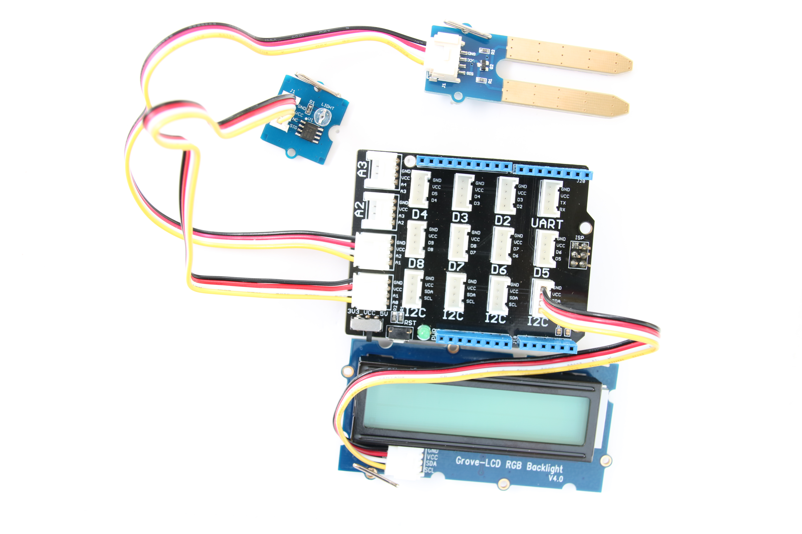
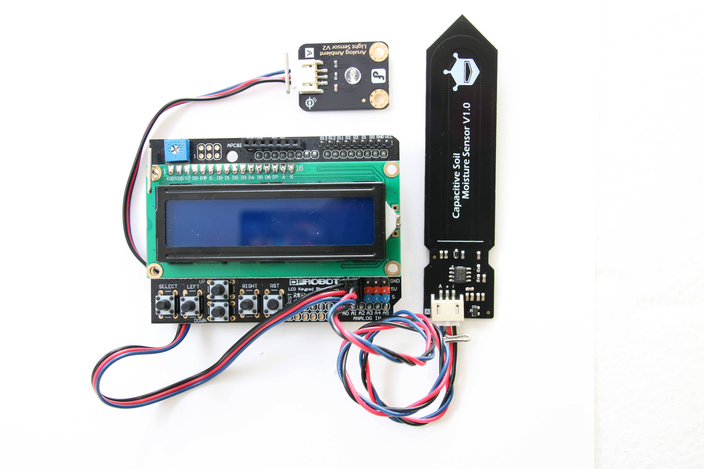
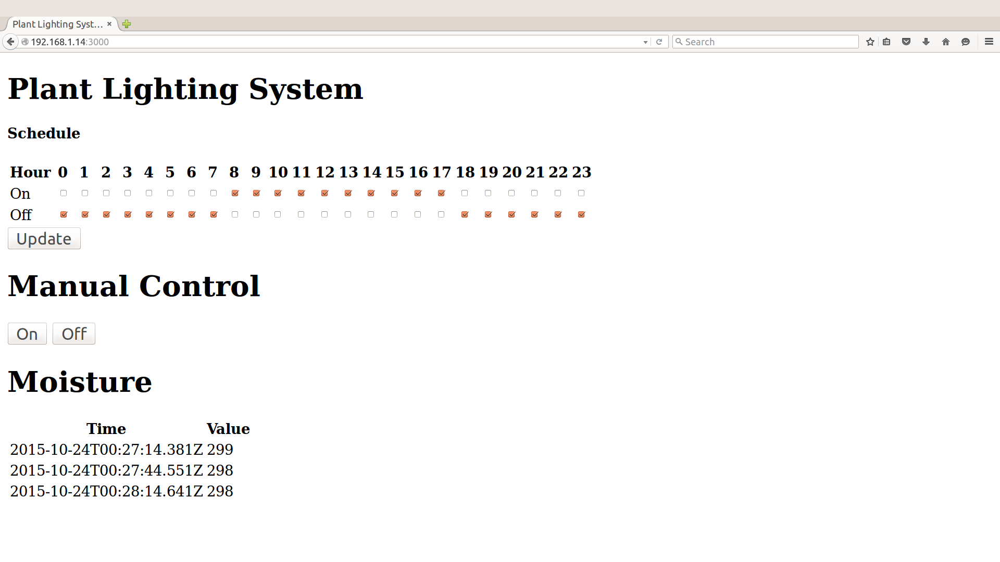

# Plant lighting system in JavaScript*

## Introduction

This automatic plant lighting system monitor application is part of a series of how-to Internet of Things (IoT) code sample exercises using the Intel® IoT Developer Kit, and a compatible Intel® IoT Platform, cloud platforms, cloud platforms, APIs, and other technologies.

From this exercise, developers will learn how to:<br>

- Interface with and sensors using MRAA and UPM from the Intel® IoT Developer Kit, a complete hardware and software solution to help developers explore the IoT and implement innovative projects.<br>
- Set up a web application server to let users enter the access code to disable the alarm system and store this alarm data using Azure Redis Cache\* from Microsoft Azure\*, Redis Store\* from IBM Bluemix\*, or Elasticache\* using Redis\* from Amazon Web Services (AWS)\*, different cloud services for connecting IoT solutions including data analysis, machine learning, and a variety of productivity tools to simplify the process of connecting your sensors to the cloud and getting your IoT project up and running quickly.
- Connect to a server using IoT Hub from Microsoft Azure\*, IoT from IBM Bluemix\*, IoT from Amazon Web Services (AWS)\*, AT&T M2X\*, Predix\* from GE, or SAP\* Cloud Platform IoT, different cloud-based IoT platforms for machine to machine communication.
- Invoke the services of the Twilio\* API for sending text messages.

## What it is

Using a compatible Intel® IoT Platform, this project lets you create an automatic plant lighting monitor system that:<br>
- uses a light sensor to determine if a separate automated lighting system is turned on or off based on a configurable schedule.<br>
- can be accessed with your mobile phone via the built-in web interface to set the lighting times.<br>
- monitors the water levels using a connected moisture sensor.<br>
- logs events from the lighting system using cloud-based data storage.<br>
- sends text messages to alert recipients if the system if not working as expected.

## How it works

The system allows setting the lighting schedule via a web page served directly from the Intel® IoT Platform by using your mobile phone.

If the lighting is supposed to be on, but the light sensor does not detect any light, it sends a text alert to a specified number through Twilio\*.

It also automatically checks and logs moisture sensor data at periodic intervals.

Optionally, data can be stored using your own Microsoft Azure\*, IBM Bluemix\*, AT&T M2X\*, AWS\*, Predix\*, or SAP\* account.

## First time setup  
For all the samples in this repository, see the  for supported boards and libraries.

## Hardware requirements

In addition to using a compatible platform listed in , here is additional hardware you will need to run this example.

This sample can be used with either Grove or DFRobot components.

Grove\* Indoor Environment Kit, containing:

1. [Grove\* Base Shield V2](https://www.seeedstudio.com/Base-Shield-V2-p-1378.html)
2. [Grove\* Moisture Sensor](http://iotdk.Intel®.com/docs/master/upm/node/classes/grovemoisture.html)
3. [Grove\* Light Sensor](http://iotdk.Intel®.com/docs/master/upm/node/classes/grovelight.html)
4. [Grove\* RGB LCD](http://iotdk.Intel®.com/docs/master/upm/node/classes/jhd1313m1.html)

DFRobot\* Starter Kit for Intel® Edison containing:

2. [Moisture Sensor](http://www.dfrobot.com/index.php?route=product/product&product_id=599).
3. [Analog Ambient Light Sensor](www.dfrobot.com/index.php?route=product/product&product_id=1004)
4. [LCD Keypad Shield](http://iotdk.intel.com/docs/master/upm/node/classes/sainsmartks.html)

## Software requirements

2. MRAA and UPM Node.js bindings <link to mraa and upm install docs>
2. Packages as listed in the package.json file in this example
2. Microsoft Azure\*, IBM Bluemix\*, AT&T M2X\*, AWS\*, Predix\*, or SAP\* account (optional)
3. Twilio\* account (optional)

### Connecting the Grove\* sensors



You need to have a Grove\* Shield connected to an Arduino\* compatible breakout board to plug all the Grove\* devices into the Grove\* Shield. Make sure you have the tiny VCC switch on the Grove\* Shield set to **5V**.

Sensor | Pin
--- | ---
Grove\* Light Sensor | A0
Grove\* Moisture Sensor | A1
Grove\* RGB LCD | I2C

### Connecting the DFRobot\* sensors



You need to have a LCD Keypad Shield connected to an Arduino\* compatible breakout board to plug all the DFRobot\* devices into the LCD Keypad Shield.

Sensor | Pin
--- | ---
Analog Ambient Light Sensor | A1
Moisture Sensor | A2

### Twilio\* API key

To optionally send text messages, you need to register for an account and get an API key from the Twilio\* website:

<a href="https://www.twilio.com">https://www.twilio.com</a>

You cannot send text messages without obtaining a Twilio API key first. You can still run the example, but without the text messages.

### IoT cloud setup (optional)

You can optionally store the data generated by this sample program using cloud-based IoT platforms from Microsoft Azure\*, IBM Bluemix\*, AT&T M2X\*, AWS\*, Predix\*, or SAP\*.

For information on how to connect to your own cloud server, go to:

[https://github.com/intel-iot-devkit/iot-samples-cloud-setup](https://github.com/intel-iot-devkit/iot-samples-cloud-setup)

### Datastore server setup (optional)

Optionally, you can store the data generated by this sample program in a back-end database deployed using Microsoft Azure\*, IBM Bluemix\*, or AWS, along with Node.js\*, and a Redis\* data store.

For information on how to set up your own cloud data server, go to:

[https://github.com/Intel-iot-devkit/Intel-iot-examples-datastore](https://github.com/Intel-iot-devkit/Intel-iot-examples-datastore)

## Configuring the example

To configure the example for the Grove\* kit, just leave the `kit` key in the `config.json` set to `grove`. To configure the example for the DFRobot\* kit, change the `kit` key in the `config.json` to `dfrobot` as follows:

```
{
  "kit": "dfrobot"
}
```

To configure the example for the Arduino 101, add a `platform` key with the value `firmata` to the `config.json`, as follows:

```
{
  "kit": "grove",
  "platform": "firmata"
}
```

To configure the example for sending optional text messages, obtain an API key from the Twilio\* web site as explained above, and then add the `TWILIO_ACCT_SID` and `TWILIO_AUTH_TOKEN` keys to the `config.json` file as follows:

```
{
  "kit": "grove",
  "TWILIO_ACCT_SID": "YOURAPIKEY",
  "TWILIO_AUTH_TOKEN": "YOURTOKEN"
}
```

To configure the example for the optional Microsoft Azure\*, IBM Bluemix\*, or AWS data store, add the `SERVER` and `AUTH_TOKEN` keys to the `config.json` file as follows:

```
{
  "kit": "grove",
  "SERVER": "http://Intel-examples.azurewebsites.net/logger/lighting-system",
  "AUTH_TOKEN": "s3cr3t"
}
```

To configure the example for both the text messages and the Microsoft Azure\*, IBM Bluemix\*, or AWS data store, add the `TWILIO_ACCT_SID`, `TWILIO_AUTH_TOKEN`, `SERVER`, and `AUTH_TOKEN` keys to the `config.json` file as follows:

```
{
  "kit": "grove",
  "TWILIO_ACCT_SID": "YOURAPIKEY",
  "TWILIO_AUTH_TOKEN": "YOURTOKEN",
  "SERVER": "http://Intel-examples.azurewebsites.net/logger/lighting-system",
  "AUTH_TOKEN": "s3cr3t"
}
```

For information on how to configure the example for an optional Microsoft Azure\*, IBM Bluemix\*, AT&T M2X\*, AWS\*, Predix\*, or SAP\* IoT cloud server, go to:

[https://github.com/intel-iot-devkit/iot-samples-cloud-setup](https://github.com/intel-iot-devkit/iot-samples-cloud-setup)

## Running the program 

To run this example on the board, simply enter

    $ npm install
    $ npm run

### Setting the lighting schedule



The schedule for the lighting system is set using a single-page web interface served from the Intel® IoT Platform while the sample program is running.

The web server runs on port `3000`; if the Intel® IoT Platform is connected to Wi-Fi on `192.168.1.13`, the address to browse to if you are on the same network is `http://192.168.1.13:3000`.

### Determining your platform's IP Address

See the section on Finding Your Board's IP Address at the bottom of the  readme. 

IMPORTANT NOTICE: This software is sample software. It is not designed or intended for use in any medical, life-saving or life-sustaining systems, transportation systems, nuclear systems, or for any other mission-critical application in which the failure of the system could lead to critical injury or death. The software may not be fully tested and may contain bugs or errors; it may not be intended or suitable for commercial release. No regulatory approvals for the software have been obtained, and therefore software may not be certified for use in certain countries or environments.
