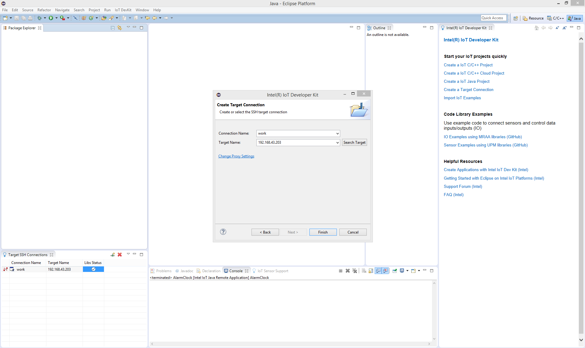
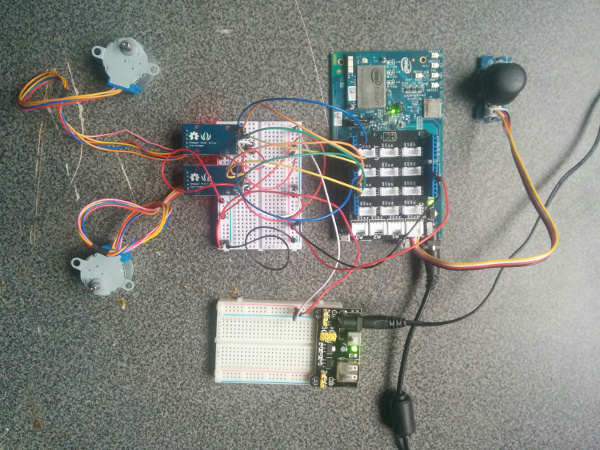

# Robot arm in Java*

## Introduction

This robot arm application is part of a series of how-to Internet of Things (IoT) code sample exercises using the Intel® IoT Developer Kit, Intel® Edison development platform, cloud platforms, APIs, and other technologies.

From this exercise, developers will learn how to: 
- Connect the Intel® Edison development platform, a computing platform designed for prototyping and producing IoT and wearable computing products. 
- Interface with the Intel® Edison platform IO and sensor repository using MRAA and UPM from the Intel® IoT Developer Kit, a complete hardware and software solution to help developers explore the IoT and implement innovative projects. 
- Run this code sample in Intel® System Studio IoT Edition. Intel® System Studio IoT Edition lets you create and test applications on Intel-based IoT platforms. 
- Set up a web application server to control a robot arm using a web page served directly from the Intel® Edison board.

## What it is

Using an Intel® Edison board, this project lets you create a robot arm that: 
- continuously checks the Grove* Joystick. 
- moves two stepper motors based on the joystick control. 
- can be accessed via the built-in web interface to control the motors.

## How it works

The robot arm example allows you to control a robotic arm using a thumb joystick.
Each axis of the joystick corresponds to a motor to control.

Additionally, the motors can be controlled individually via a web page served directly from the Intel® Edison board.

## Hardware requirements

Grove* Robotics Kit containing:

1. Intel® Edison platform with an Arduino* breakout board
2. [Grove* Thumb Joystick](http://iotdk.intel.com/docs/master/upm/node/classes/joystick12.html)
3. [Stepper Motor Controller & Stepper Motor](http://iotdk.intel.com/docs/master/upm/node/classes/uln200xa.html) (x2)

## Software requirements

1. Intel® System Studio IoT Edition

### How to set up

To begin, clone the **How-To Code Samples** repository with Git* on your computer as follows:

    $ git clone https://github.com/intel-iot-devkit/how-to-code-samples.git

To download a .zip file, in your web browser, go to <a href="https://github.com/intel-iot-devkit/how-to-code-samples">https://github.com/intel-iot-devkit/how-to-code-samples</a> and click the **Download ZIP** button at the lower right. Once the .zip file is downloaded, uncompress it, and then use the files in the directory for this example.

## Adding the program to Intel® System Studio IoT Edition

 ** The following screenshots are from the Alarm clock sample, however the technique for adding the program is the same, just with different source files and jars.

Open Intel® System Studio IoT Edition. It will start by asking for a workspace directory; choose one and then click OK.

In Intel® System Studio IoT Edition, select File -> new -> **Intel(R) IoT Java Project**:

Give the project the name "RobotArm" and then click Next.

You now need to connect to your Intel® Edison board from your computer to send code to it.
Choose a name for the connection and enter the IP address of the Intel® Edison board in the "Target Name" field. You can also try to Search for it using the "Search Target" button. Click finish when you are done.

You have successfully created an empty project. You now need to copy the source files and the config file to the project.
Drag all of the files from your git repository's "src" folder into the new project's src folder in Intel® System Studio IoT Edition. Make sure previously auto-generated main class is overridden.

The project uses the following external jars: [jetty-all-9.3.7.v20160115-uber](http://repo1.maven.org/maven2/org/eclipse/jetty/aggregate/jetty-all/9.3.7.v20160115/jetty-all-9.3.7.v20160115-uber.jar). These can be found in the Maven Central Repository. Create a "jars" folder in the project's root directory, and copy all needed jars in this folder.
In Intel® System Studio IoT Edition, select all jar files in "jars" folder and  right click -> Build path -> Add to build path

Now you need to add the UPM jar files relevant to this specific sample.
Right-click on the project's root -> Build path -> Configure build path. Java Build Path -> 'Libraries' tab -> click on "add external JARs..."

For this sample you will need the following jars:

1. upm_uln200xa.jar
2. upm_joystick.jar

The jars can be found at the IOT Devkit installation root path\iss-iot-win\devkit-x86\sysroots\i586-poky-linux\usr\lib\java

### Connecting the Grove* sensors

You need to have a Grove* Shield connected to an Arduino*-compatible breakout board to plug all the Grove devices into the Grove Shield. Make sure you have the tiny VCC switch on the Grove Shield set to **5V**.

You need to have a Grove Shield connected to an Arduino-compatible breakout board to plug all the Grove devices into the Grove Shield. Make sure you have the tiny VCC switch on the Grove Shield set to **5V**.

You need to power the Intel® Edison board with the external power adapter that comes with your starter kit, or substitute it with an external 12V 1.5A power supply. You can also use an external battery, such as a 5V USB battery.

In addition, you need a breadboard and an extra 5V power supply to provide power to both motors. Note: you need a separate battery or power supply for the motors. You cannot use the same power supply for both the Intel® Edison board and the motors, so you need either 2 batteries or 2 power supplies in total.

1. Plug each of the stepper motor controllers into four pins on the Arduino breakout board for it to be able to be controlled. Connect stepper motor controller #1 to pins 4, 5, 6, and 7. Connect stepper motor controller #2 to pins 9, 10, 11, and 12. Connect both controllers to ground (GND), to the 5V power coming from the Arduino* breakout board (VCC), and to the separate 5V power for the motors (VM).

2. Plug one end of a Grove cable into the Grove Thumb Joystick, and connect the other end to the A0 port on the Grove Shield.

## Preparing the Intel® Edison board before running the project

In order for the sample to run you will need to copy some files to the Intel® Edison board. This can be done using SCP through SSH.

Two sorts of files need to be copied from the sample repository:

1. Jar files- external libraries in the project need to be copied to "/usr/lib/java"
2. web files- files within site_contents folder need to be copied to "/var/RobotArm"

## Running the program using Intel® System Studio IoT Edition

When you're ready to run the example, make sure you have saved all the files.

Click the **Run** icon on the toolbar of Intel® System Studio IoT Edition. This runs the code on the Intel® Edison board.

You will see output similar to the following when the program is running.

### Controlling via a browser

Optionally, the motors can be controlled directly via a web page served by the program running on the Intel® Edison board.

The web server runs on port `8080`, so if the Intel® Edison board is connected to Wi-Fi* on `192.168.1.13`, the address to browse to if you are on the same network is `http://192.168.1.13:8080`.

### Determining the IP address of the Intel® Edison board

You can determine what IP address the Intel® Edison board is connected to by running the following command:

    ip addr show | grep wlan

You will see output similar to the following:

    3: wlan0: <BROADCAST,MULTICAST,UP,LOWER_UP> mtu 1500 qdisc pfifo_fast qlen 1000
        inet 192.168.1.13/24 brd 192.168.1.255 scope global wlan0

The IP address is shown next to `inet`. In the example above, the IP address is `192.168.1.13`.

IMPORTANT NOTICE: This software is sample software. It is not designed or intended for use in any medical, life-saving or life-sustaining systems, transportation systems, nuclear systems, or for any other mission-critical application in which the failure of the system could lead to critical injury or death. The software may not be fully tested and may contain bugs or errors; it may not be intended or suitable for commercial release. No regulatory approvals for the software have been obtained, and therefore software may not be certified for use in certain countries or environments.
