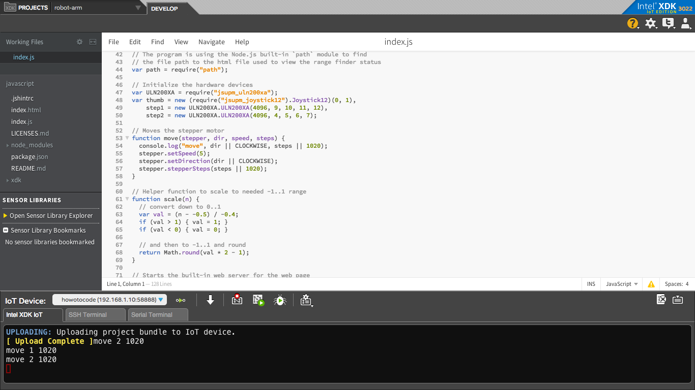

## What it is

Using a compatible Intel® IoT Platform, this project lets you create a robot arm that:<br>
- continuously checks the Grove\* Joystick.<br>
- moves two stepper motors based on the joystick control.<br>
- can be accessed via the built-in web interface to control the motors.

Additionally, the motors can be controlled individually via a web page served directly from the Intel® IoT Platform.

## First time setup  
For all the samples in this repository, see the  for required boards and libraries. You need either Grove or DFRobot sensors but not both.

## Hardware requirements

### Grove\*

You need to have a Grove\* Shield connected to an Arduino\* compatible breakout board to plug all the Grove devices into the Grove Shield. Make sure you have the tiny VCC switch on the Grove Shield set to **5V**.

You need to power the Intel® IoT Platform with the external power adapter that comes with your starter kit, or substitute it with an external 12V 1.5A power supply. You can also use an external battery, such as a 5V USB battery.

In addition, you need a breadboard and an extra 5V power supply to provide power to both motors. Note: you need a separate battery or power supply for the motors. You cannot use the same power supply for both the Intel® IoT Platform and the motors, so you need either 2 batteries or 2 power supplies in total.

Sensor | Pin
--- | ---
Stepper motor controller #1 | Digital pins 4, 5, 6, and 7
Stepper motor controller #2 | Digital pins 9, 10, 11, and 12
Both controllers to ground (GND) | 5V power coming from the Arduino\* breakout board (VCC), and to the separate 5V power for the motors (VM).

More details on the hardware requirements can be found in the 

## Software requirements

1.  and  
1. Node.js 
2. MRAA and UPM Node.js bindings <link to mraa and upm install docs>
2. Packages as listed in the package.json file in this example 

## Configuring the example

To configure the example for the Intel® Edison board, just leave the `platform` key in the `config.json` set to `edison`. To configure the example for the Intel® IoT Gateway, change the `platform` key in the `config.json` to `firmata` as follows:

```
{
  "platform": "firmata"
}
```
## Running the program 

To run this example on the board, simply enter

    $ npm install
    $ npm run
    $ ./robot-arm
    
You will see output similar to below when the program is running.



Refer to  for details on the functionality.

IMPORTANT NOTICE: This software is sample software. It is not designed or intended for use in any medical, life-saving or life-sustaining systems, transportation systems, nuclear systems, or for any other mission-critical application in which the failure of the system could lead to critical injury or death. The software may not be fully tested and may contain bugs or errors; it may not be intended or suitable for commercial release. No regulatory approvals for the software have been obtained, and therefore software may not be certified for use in certain countries or environments.
